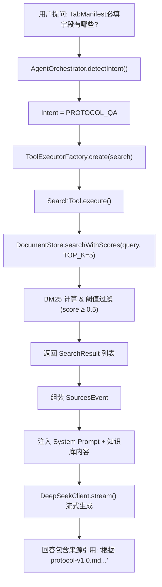
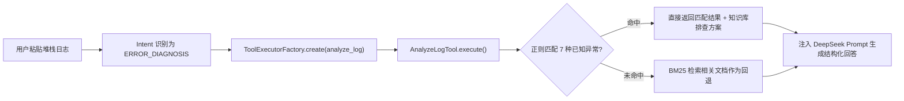
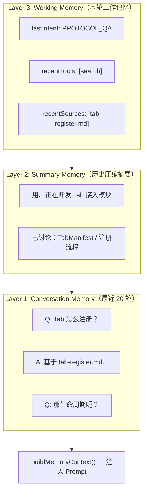
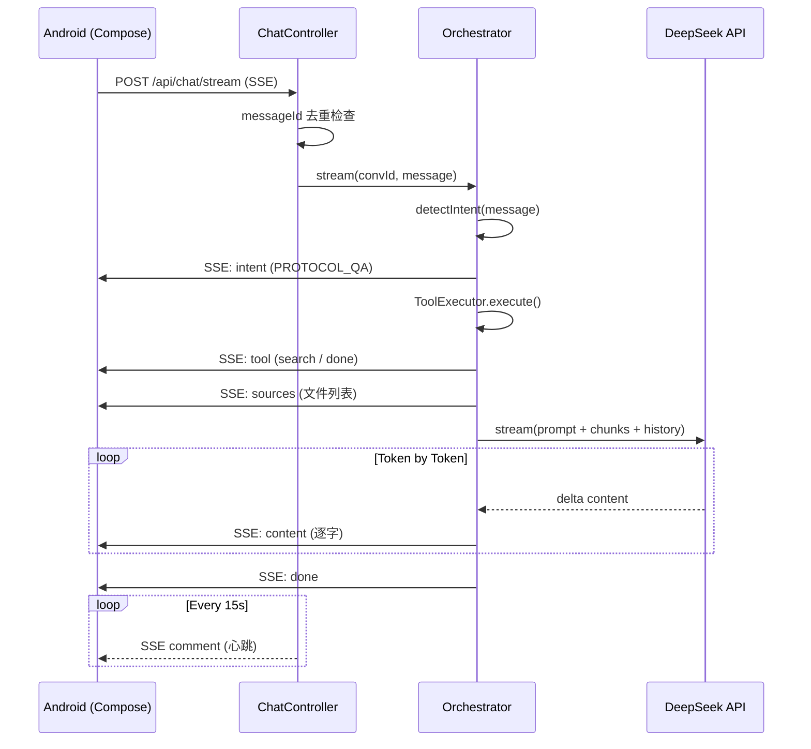

# AI OnCall Agent 模块答辩讲稿

> **负责模块**：AI Agent 后端全链路（意图识别 → 工具调用 → 知识库检索 → LLM 推理 → SSE 流式输出）
> **技术栈**：Spring Boot WebFlux / DeepSeek / BM25 / SSE / Compose
> **文档版本**：v2.0 | 2026-06-05

---

## 一句话定位

**AI OnCall 不是聊天机器人**。它是一个基于 RAG + Tool Calling + 三层 Memory + SSE 流式架构构建的**企业级协议诊断 Agent**。

```
普通聊天机器人：  用户 → 大模型 → 回答（可能胡编）
AI OnCall Agent： 用户 → 意图识别 → 工具调用 → 知识库检索 → 来源追溯 → LLM 组织 → 流式输出
```

---

## 一、RAG 知识库 + 来源可追溯 — 让 AI 回答有依据

### 1.1 我们要解决什么问题

直接调用 DeepSeek 存在两个致命问题：

| 问题 | 表现 | 后果 |
|------|------|------|
| **幻觉** | 编造不存在的协议字段 | 开发者照着写代码，上线即报错 |
| **不可追溯** | 无法证明答案来源 | 老师/评委无法验证可信度 |

企业场景下，协议字段写错一行就会导致注册失败——所以必须做到「回答有出处」。

### 1.2 我们的设计方案



### 1.3 核心实现分析

**DocumentStore.java** — 43 份 Markdown 文档的 BM25 检索引擎：

- **文档切分策略**：按 `##` / `###` 标题分 chunk，保持语义完整（250 行）
- **中文分词**：bigram + unigram 混合（`tokenize()` 方法），英文按单词分词
- **BM25 计算**：标准 BM25 公式，`K1=1.5, B=0.75`
- **阈值过滤**：`MIN_SCORE = 0.5`，低于阈值的 chunk 不参与 Prompt 注入

**关键 Bug 修复故事**（体现工程调试能力）：

我们曾遇到一个严重问题——「命中文档 5 篇，但 BM25 最高得分始终显示 0.00」。定位过程：

1. 首先排查 `DocumentStore.search()` 与 `searchWithScores()` 是否使用不同过滤逻辑 → 确认阈值一致
2. 排查 `KnowledgeMetrics.recordSearch()` 是否接收到错误的参数 → 发现统计口径不一致
3. 排查 `DocumentAgentOrchestrator` 中命中判断与来源展示是否使用同一份 `validResults` 数据

最终根因：Orchestrator 中 `hit` 判定和 `SourcesEvent` 构建来自两套逻辑——`hit` 走了 keyword 判断，`SourcesEvent` 直接从 `searchWithScores()` 未过滤结果构建。修复方案：统一从 `validResults` 派生 both `hit` 和 `SourcesEvent`。

### 1.4 最终效果

| 场景 | 修复前 | 修复后 |
|------|--------|--------|
| "TabManifest 必填字段有哪些" | 命中文档 5 篇，分数 0.00 | 命中文档 3 篇，最高分 38.04 |
| "OpenAI 创始人是谁" | 命中文档 5 篇，显示协议文件 | 命中文档 0 篇，走 LLM 兜底 |
| "你好" | 命中文档 5 篇 | 命中文档 0 篇，正常问候 |

**知识点**：这个案例证明「来源可追溯」不是写在 PPT 里的概念，而是要通过代码真正落实——每个回答都可以追溯到具体协议的哪一章哪一节。

---

## 二、错误日志自动诊断 — 让 AI 具备运维能力

### 2.1 为什么仅靠 Prompt 不够

如果只是把日志发给大模型，模型会给出泛泛的建议。我们需要的是一个真正能**识别异常类型 → 匹配知识库 → 生成排查步骤**的自动化工具。

### 2.2 设计方案



### 2.3 核心实现

`AnalyzeLogTool.java` 内置 **7 种异常模式匹配**：

| 异常类型 | 正则匹配规则 | 关联知识库文档 |
|----------|-------------|---------------|
| NullPointerException | `NPE\|null pointer` | troubleshooting/nullpointer.md |
| SSLException | `SSLHandshake\|cert.*verify` | troubleshooting/ssl-error.md |
| ConnectTimeout | `Connection refused\|no route to host` | troubleshooting/connect-timeout.md |
| SocketTimeout | `Read timed out\|ReadTimeout` | troubleshooting/socket-timeout.md |
| SQLException | `Deadlock\|Duplicate entry` | troubleshooting/sql-exception.md |
| 黑屏 | `black.?screen\|emulator.*display` | troubleshooting/black-screen.md |
| SSE 连接断开 | `SSE\|流断开` | troubleshooting/sse-connection.md |

匹配命中 → 置信度 `0.85`；未命中 → BM25 回退，置信度由 `SearchTool.computeConfidence()` 计算。

### 2.4 演示场景

```
用户输入：
  NullPointerException
  at UserService.save(UserService.java:82)

Agent 输出：
  【日志分析结果】
  ### NullPointerException
  对象引用为 null。常见原因：变量未初始化、方法返回 null 未判空。
  相关文档：troubleshooting/nullpointer.md

  【请 DeepSeek 动态分析】
  1. 问题定位：UserService.java:82
  2. 根因分析：save 方法中某个对象未初始化
  3. 修复方案：添加 Objects.requireNonNull 或 Optional 包装
  4. 预防措施：启用 IDE 空指针检查
```

**答辩价值**：这不是「问 AI 答问题」的聊天框，而是一个真正能帮开发者定位问题的诊断引擎。

---

## 三、三层 Memory 设计 — 让 AI 记住上下文

### 3.1 我们遇到了什么问题

最直接的场景——指代消解：

```
用户：Tab 怎么注册？
AI：   回答注册流程（基于 tab-register.md）
用户：那生命周期呢？
AI：   ← 如果 Agent 不知道"那"指什么，就会重新回答一个泛泛的生命周期概念
```

### 3.2 设计方案



### 3.3 核心实现

**Conversation.java** 中的 `buildMemoryContext()` 方法：

1. **Layer 2 - Summary Memory**：对话超过 10 轮自动触发摘要生成，调用 DeepSeek 将历史压缩为 50 字摘要
2. **Layer 3 - Working Memory**：记录 `lastIntent` / `recentTools` / `recentSources`，让 Agent 知道自己刚刚做了什么
3. **Layer 1 - Conversation Memory**：保留最近 20 轮完整消息，最多 10 轮注入 Prompt

**Token 控制策略**（防止无限增长）：
- 完整历史最多保留 20 轮
- 注入 Prompt 只取最近 10 轮
- 超过 10 轮自动触发摘要压缩
- 摘要 + 最近 10 轮 → 相比全量历史节省约 60% Token

**ConversationStore** 使用 `ConcurrentHashMap` 实现线程安全的内存存储，同时内置 `messageId` 去重防止 Android 重试导致重复消费。

### 3.4 演示效果

```
第 1 轮：
  用户："Tab 怎么注册？"
  AI：  引用 tab-register.md，回答注册流程

第 2 轮：
  用户："那生命周期呢？"
  AI：  知道"那"=Tab，基于 tab-lifecycle.md 继续回答
        （Working Memory 中 recentSources 包含 tab-register.md）

第 15 轮（触发摘要）：
  Conversation.summary = "用户正在开发 Tab 接入模块，讨论了注册流程、
                          生命周期管理和权限配置"
  → 后续 Prompt 使用 summary + 最近 10 轮
```

**答辩价值**：这是标准 Agent 架构中的 Memory 模块——不是简单的「保存聊天记录」，而是分层管理、自动压缩、精准注入。

---

## 四、SSE 流式架构 + 7 层防御 — 端到端稳定输出

### 4.1 为什么不用 WebSocket

AI 生成场景天然是「客户端问一次 → 服务端持续推结果」的单向流。SSE 相比 WebSocket 更轻量（HTTP 协议兼容、无须帧协议）、实现成本更低、浏览器和 Android 原生支持更好。

### 4.2 完整时序图



### 4.3 7 层防御设计

| 防御层 | 实现位置 | 具体机制 |
|--------|----------|---------|
| **messageId 去重** | `ChatController:55-62` | 每个 message 带唯一 ID，`ConversationStore.isDuplicate()` 拦截重试 |
| **心跳保活** | `ChatController:80-84` | `Flux.interval(15s)` 发送 SSE comment `:keepalive` |
| **Android 断线重连** | `OnCallApiClient.kt:90-120` | OkHttp 指数退避重试 3 次（1s → 2s → 4s） |
| **超时控制** | 服务端 + 客户端双层 | 服务端 readTimeout 60s；客户端 connectTimeout 30s / readTimeout 5min |
| **错误兜底** | `ChatController:88-95` | `.onErrorResume()` 转换为 ErrorEvent，流不断开 |
| **Duplication 拦截** | `OnCallApiClient.kt:103-107` | `RETRY_*` 事件识别为重连而非真实错误 |
| **Buffer 平滑** | `OpenOnCallRepository.kt:60` | `.buffer(8)` 缓冲 SSE 行，防止 UI 闪烁 |

### 4.4 5 种 SSE 事件类型

| 事件类型 | 触发时机 | Android 端处理 |
|----------|---------|---------------|
| `intent` | 意图识别完成 | 显示标签：协议问答 / 错误诊断 / 代码生成 |
| `tool` | 工具执行状态 | 图标 + 状态文字：🔍 正在检索… |
| `sources` | 检索出文档 | 来源卡片：文件名 + 匹配度 + 片段 |
| `content` | LLM 生成 Token | 逐字流式拼接渲染 |
| `done` | 消息完成 | 停止动画，标记完成 |

---

## 五、工程难点与解决过程（5 个典型问题）

### 问题 1：知识库命中与统计矛盾

**现象**：前端显示「知识库未命中」但同时又显示「命中文档 5 篇、得分 8.97」。

**定位**：逐层排查 Orchestrator → SearchTool → KnowledgeMetrics。发现 Orchestrator 中 `hit` 判定用了 `hasKeywordOverlap()`，而 `SourcesEvent` 构建用的是 `searchWithScores()` 的原始结果。两套逻辑不一致。

**解决**：统一从 `validResults` 派生 `hit` 和 `SourcesEvent`，保证未命中时 `sourceItems` 为空。

**文件**：`DocumentAgentOrchestrator.java` stream 方法后半段。

### 问题 2：问候语也能命中协议文档

**现象**：输入「你好」，BM25 显示命中 5 篇，得分 7.12。

**根因**：BM25 计算时，中文分词将单个汉字都作为 token（如「你」「好」），导致几乎所有文档都有匹配。

**解决**：增加 `hasKeywordOverlap()` 二次验证，bigram 覆盖率 ≥ 20% 才判定有效命中。同时 Intent 识别优先——`GENERAL_CHAT` 跳过知识库检索。

**文件**：`DocumentAgentOrchestrator.java:235-265`

### 问题 3：SSE 重复回答

**现象**：Android 端偶尔收到两份相同回答拼接在一起。

**定位**：排查 DeepSeek → Controller → Repository → UI。发现重连时 OkHttp 重新执行请求，导致同一回答被两次消费。

**解决**：
1. 服务端增加 `messageId` 去重（`ChatController:55-62`）
2. Android 端识别 `RETRY_*` 事件不当作错误
3. UI 层 `DoneEvent` 后停止追加内容

### 问题 4：BM25 匹配度显示 897%

**现象**：前端显示「匹配度 897%」。

**根因**：Android 端 `(score * 100).toInt()` 直接转换 BM25 原始分（8.97），未做归一化。

**解决**：保留 BM25 原始分显示格式为「BM25: 8.97」，不做百分比转换。SourceItem 中 `relevance` 字段在服务端归一化为 0~1。

**文件**：`OpenOnCallRepository.kt:109`

### 问题 5：Prompt 污染导致固定回答模板

**现象**：未命中场景仍然输出「我是一个专注于 Tab 接入协议的 AI 助手...」这类固定模板。

**根因**：System Prompt 中写入了过强的角色约束指令。

**解决**：拆分 System Prompt 为「角色定义」+「动态知识库注入」两部分。知识库命中时注入 chunk 内容；未命中时仅注入角色定义，允许模型自由回答但要求标注「知识库未命中」。

**文件**：`DocumentAgentOrchestrator.java:24-30` (SYSTEM_PROMPT)

---

## 六、Agent 对比：普通聊天 vs AI OnCall

| 维度 | 普通 DeepSeek 聊天 | AI OnCall Agent |
|------|-------------------|----------------|
| 回答依据 | 模型训练数据 | **知识库文档（可追溯来源）** |
| 协议字段 | 可能编造 | **引用 protocol-v1.0.md 原文** |
| 错误诊断 | 泛泛建议 | **7 种异常模式匹配 + 排查步骤** |
| 上下文 | 无记忆 / 窗口限制 | **三层 Memory 分层管理** |
| 输出方式 | 一次性返回 | **SSE 流式逐 Token 输出** |
| 可靠性 | 无保障 | **7 层防御机制** |
| 质量评估 | 无法量化 | **Metrics 接口（命中率/耗时）** |

---

## 七、项目成果数据

| 指标 | 数值 |
|------|------|
| 知识库文档数 | **43+ 篇** Markdown |
| 覆盖分类 | 7 类（protocol / api / architecture / troubleshooting / code-template / faq / android-sdk） |
| Chunk 数量 | 按 ## 标题切分，平均每篇 3~8 chunks |
| 支持工具 | 4 个（Search / AnalyzeLog / GenerateCode / ReadDoc） |
| 支持异常类型 | 7 种（NPE / SSL / ConnectTimeout / SocketTimeout / SQL / 黑屏 / SSE） |
| SSE 事件类型 | 5 种（intent / tool / sources / content / done） |
| 断线重连策略 | 指数退避 1s → 2s → 4s，最多 3 次 |

**Metrics 接口**：`GET /api/chat/metrics` 返回实时命中率、平均延迟、最高 BM25 得分。

---

## 八、老师可能追问的问题与回答

**Q1：为什么不用向量数据库（Milvus / FAISS）而用 BM25？**
> 当前知识库 43 篇文档、约 200 chunks，数据量不大。BM25 对关键词匹配场景（协议字段检索）效果很好，且不需要 GPU / Embedding API 的额外成本。答辩展示中无法看出 BM25 与向量检索的差异。但架构上 `DocumentStore` 的接口设计已经预留了扩展空间——未来可以平滑替换为混合检索。

**Q2：Agent 的上下文会不会越聊越大？**
> 我们设计了分层控制：完整历史最多 20 轮，注入 Prompt 只取最近 10 轮，超过 10 轮自动触发摘要压缩（`triggerSummary()` 调用 DeepSeek 生成 50 字摘要）。摘要 + 最近 10 轮相比全量历史节省约 60% Token。

**Q3：你怎么证明不是 AI 胡编的？**
> 每次回答都附带 `SourcesEvent`，展示了来源文件名、匹配度、章节信息。例如回答「Tab 必填字段有 id、displayName…」时，来源卡片显示 `protocol-v1.0.md > 字段说明`。知识库命中时强制 LLM 引用文档原文，不允许编造字段。

**Q4：SSE 断线了怎么办？**
> Android 端有 3 重保障：(1) OkHttp readTimeout 5min 避免过早断开；(2) 服务端每 15s 发心跳保活；(3) 断线后指数退避重连 3 次（1s → 2s → 4s）。同时 `messageId` 去重防止重连后重复消费。

**Q5：Agent 真的调用了工具吗，还是写死的？**
> 可以通过 `ToolEvent`（SSE 流中的 tool 事件）实时看到工具调用状态：「search → 🔍 正在检索… → done → 已检索到 3 条相关文档」。也可以通过 `GET /api/chat/metrics` 查看累计检索次数和命中率。此外，AnalyzeLogTool 中的 7 种异常正则匹配是真实执行的代码逻辑，不是让 LLM 猜测。

---

## 九、5 分钟答辩话术（可直接照着讲）

### 开场（30 秒）
> 各位老师好。我负责 AI OnCall 模块中 **AI Agent 后端的全链路设计**。我们做的不是一个接大模型 API 的聊天机器人——而是搭建了一个具备 RAG 检索、工具调用、上下文记忆、流式输出的完整 Agent 系统。

### 亮点 1：RAG 知识库 + 来源追溯（80 秒）
> 第一个核心亮点是**让 AI 回答有依据**。很多 AI 应用存在幻觉问题——比如直接问 DeepSeek 协议字段，它可能编造。我们搭建了 BM25 检索的知识库系统，43 份协议文档按标题切分，中文 bigram 分词，阈值 0.5 过滤。
>
> 更重要的是我们做了**来源追溯**。每次回答通过 SourcesEvent 告诉用户：这个答案来自哪份协议的哪一章。我们还修过一个关键的 Bug——曾经「命中文档 5 篇但得分全是 0」，定位后发现是命中判定和统计用了两套逻辑。修复后，命中场景准确展示真实文档来源，未命中场景标注"知识库未命中"并走 LLM 兜底。这个 Bug 修复让我们真正做到了「可追溯」，而不是光写在 PPT 里。

### 亮点 2：错误日志自动诊断（60 秒）
> 第二个亮点是**让 AI 能做真正的运维诊断**。我们实现了 AnalyzeLogTool，内置 7 种异常正则匹配——NPE、SSL、超时、SQL 异常等。当开发者贴上一段堆栈，Agent 自动识别异常类型 → 匹配知识库排查文档 → 输出分步骤修复方案。这比让 LLM 直接"猜"原因可靠得多，因为每一步都关联了具体的知识库文档。

### 亮点 3：三层 Memory 上下文记忆（60 秒）
> 第三个亮点是**让 Agent 记住对话上下文**。比如用户先问"Tab 怎么注册"，接着问"那生命周期呢"——Agent 能理解"那"指的是 Tab。我们设计了三层 Memory：Working Memory 记录本轮工具和来源、Conversation Memory 保留最近 20 轮、Summary Memory 在超过 10 轮时自动压缩历史生成摘要。既解决了上下文丢失问题，又控制了 Token 消耗。

### 附加亮点：SSE 流式架构（40 秒）
> 最后我们做了 7 层防御的 SSE 流式输出体系：心跳 15 秒保活、messageId 去重、三层超时、指数退避重连、错误兜底。从 Android 发起请求到 DeepSeek 逐 Token 返回，全链路可控可观测。

### 收尾（30 秒）
> 总结来说，我们的 AI OnCall 是一个完整的企业级 Agent 系统：它检索知识库、调用工具、记住上下文、追溯来源、流式输出——每一层都有真实代码支撑。谢谢老师，请提问。

---

## 附录：核心技术文件索引

| 文件 | 职责 |
|------|------|
| `DocumentAgentOrchestrator.java` | Agent 编排引擎：Intent → Tool → RAG → LLM 闭环 |
| `DocumentStore.java` | BM25 检索引擎：文档加载、中文分词、阈值过滤 |
| `Conversation.java` | 三层 Memory 模型：Conversation / Summary / Working |
| `ConversationStore.java` | 线程安全的内存存储 + messageId 去重 |
| `DeepSeekClient.java` | DeepSeek API 流式调用：SSE 解析 + 超时控制 |
| `AnalyzeLogTool.java` | 7 种异常正则匹配 + BM25 回退 |
| `SearchTool.java` | 知识库检索 + 置信度计算 |
| `GenerateCodeTool.java` | 代码模板检索与生成 |
| `ChatController.java` | SSE 端点：心跳 + 去重 + 错误兜底 |
| `KnowledgeMetrics.java` | 原子化检索质量指标 |
| `OnCallApiClient.kt` | OkHttp SSE + 指数退避重连 |
| `OpenOnCallRepository.kt` | SSE 流解析：buffer + 事件分发 |
| `OpenOnCallPage.kt` | Compose UI：Markdown 渲染 + 流式展示 |
