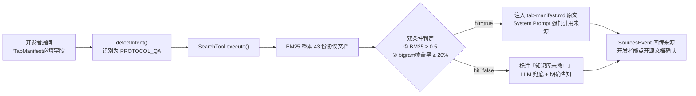
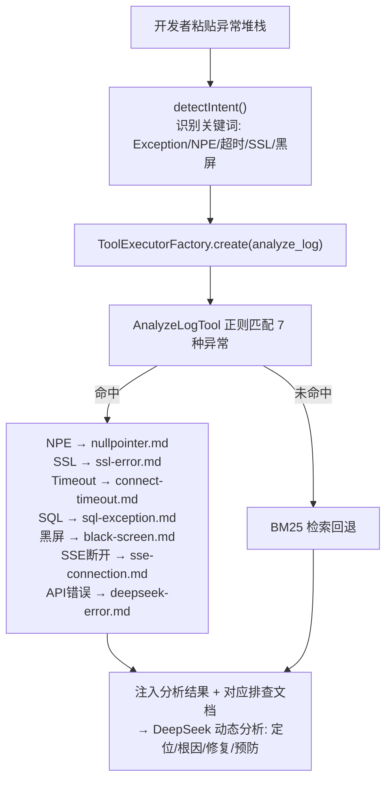
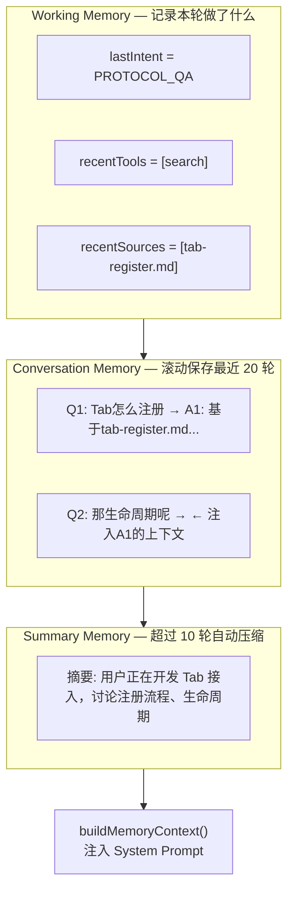
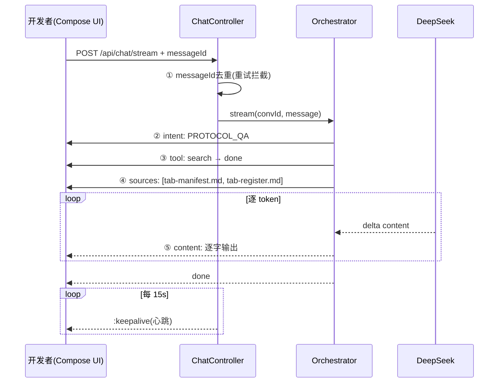

# AI OnCall Agent — 答辩讲稿

> **一句话**：AI OnCall 是为 OpenTab 容器内嵌的业务开发助手，不是通用聊天框。它基于 43 份 Tab 接入协议文档构建 RAG 知识库，开发者问"TabManifest 必填字段有哪些"时，Agent 直接检索 `tab-manifest.md` 原文回答，而不是让大模型瞎编。

---

## 先看一个真实问答

**开发者问**：`TabManifest 必填字段有哪些？`

**普通聊天机器人**：
> TabManifest 一般包含 id、name、title、url 等字段……

— 它编了 `name`、`title`、`url`，OpenTab 协议里根本没有这三个字段。

**AI OnCall Agent**：
> 根据 `protocol/tab-manifest.md > 字段约束`：
> - `id`：必填，反向域名格式，全局唯一
> - `displayName`：必填，≤16 字符
> - `route`：必填，/ 开头
> - `entryType`：必填，native/web/hybrid/external
> - `version`：必填，major.minor.patch
>
> 📚 来源：tab-manifest.md（BM25 得分 38.04）

— 每个字段都来自协议原文，有出处、可追溯。

---

## 亮点一：RAG 知识库 — 回答必须出自协议文档，不准编

### 它解决什么问题

OpenTab 协议有精确定义：`TabDefinition` 的 6 个字段、`TabManifest` 的 13 个字段、6 种错误码（1001~1006）、生命周期 4 个回调。直接问大模型，它不知道这些协议细节，只能"猜"——这在企业场景下不可接受，开发照着编造字段写代码，注册直接失败。

### 怎么做的



### 具体做了什么（结合项目）

| 组件 | 做了什么 | 解决什么问题 |
|------|---------|-------------|
| **文档切分** | 43 份 `.md` 按 `##` 标题切 chunk，「字段约束」表格和代码块不拆散 | 开发者问"Tab 必填字段"，能精确命中 `tab-manifest.md` 的字段约束表 |
| **BM25 检索** | 中文 bigram+unigram，`K1=1.5, B=0.75` | "TabManifest 必填字段"能匹配到"必填"、"字段"、"TabManifest"（英文词）|
| **双条件命中** | ① BM25 ≥ 0.5 ② bigram 覆盖率 ≥ 20% | 防止"你好"也命中 5 篇协议文档（曾真实发生过） |
| **hit 切换 Prompt** | `hit=false` 时 System Prompt 不注入 chunk、标注"知识库未命中" | 避免"未命中"却展示 5 个来源的矛盾（曾修复的关键 Bug）|

### 修复过什么坑

**Bug**：前端同时显示"知识库未命中"和"命中文档 5 篇、得分 8.97"。
**根因**：`hit` 判定用了 `hasKeywordOverlap()`，`SourcesEvent` 构建用了 `searchWithScores()` 的原始结果——同一份数据，两套判断逻辑。
**修复**：统一从过滤后的 `validResults` 派生 hit 和 SourcesEvent——`hit=false` 时 `sourceItems` 一定空。

---

## 亮点二：错误诊断 — 粘贴堆栈 → 自动输出定位 + 修复方案

### 它解决什么问题

OpenTab 开发者最常见的 7 类异常：

- NPE → Tab 注册时 Manifest 对象为 null
- SSL → 自签名证书连不上 DevServer
- 1001 → Tab ID 重复注册
- 1003 → Tab 缺少必填字段
- 1004 → 生命周期回调超时 5s，显示兜底页
- 超时 → DeepSeek API 连接超时
- 黑屏 → 模拟器 GPU 渲染不兼容

开发者遇到异常 → 复制堆栈 → 百度 → CSDN → 试错，平均耗时 30 分钟。

### 怎么做的



### 具体做了什么（结合项目）

**AnalyzeLogTool** 中内置的正则匹配不是通用的，而是针对本项目：

```text
NPE → 定位到本项目真实可能出现 NPE 的位置：
  - DocumentStore.loadFile() → docsPath 目录不存在
  - DeepSeekClient.extractDeltaContent() → JSON 中 choices/delta 为 null  
  - ConversationStore.getOrCreate() → 首次会话

SSL → 关联 troubleshooting/ssl-error.md：
  - 自签名证书不信任 → 配置 trustManager
  - 证书过期 → 更新 DevServer 证书

错误码 1003 → 关联 protocol/tab-error-code.md：
  - id/displayName/icon/route/version 任一为空 → 容器拒绝加载
```

**答辩演示**：现场粘贴一条 `1003 缺少必填字段` 日志 → Agent 输出"你的 TabManifest 中 `route` 字段缺失，参考 `tab-manifest.md` 字段约束表"。

---

## 亮点三：三层 Memory — 追问时 Agent 知道"那"指的是什么

### 它解决什么问题

```
开发者：Tab 怎么注册？
AI：    基于 tab-register.md，需要声明 TabDefinition...
开发者：那生命周期呢？
普通AI： （不知道"那"指什么，重新回答泛泛的"Android 生命周期"）
AI OnCall：（知道"那"=Tab，基于 tab-lifecycle.md 继续回答具体 4 个回调）
```

### 怎么做的



### 具体做了什么

- **Conversation Memory**：最多存 20 轮，注入 Prompt 只取最近 10 轮 — 不是无脑全量
- **Working Memory**：每轮记录 `lastIntent`、`recentTools`、`recentSources` — 追问时 Prompt 自动带上"最近引用的文档：tab-register.md"
- **Summary Memory**：`needsSummarization()` 在 ≥10 轮时触发 → 调用 DeepSeek 生成 50 字摘要 → 替换早期历史 → Token 比全量节省约 60%

### Token 控制

| 阶段 | 注入量 | 场景 |
|------|--------|------|
| 1~9 轮 | 全部历史 | 正常对话 |
| ≥10 轮 | summary + 最近 10 轮 | 自动压缩 |
| 任何时候 | Conversation 最多存 20 轮 | 防止内存泄漏 |

---

## 加分：SSE 流式 + 防御 — 从 Android 到 DeepSeek 全链路可控



**7 层防御**：①messageId 去重 → ②心跳 15s → ③指数退避重连(1s→2s→4s) → ④connectTimeout 30s/readTimeout 5min → ⑤ErrorEvent 兜底 → ⑥RETRY 识别不报错 → ⑦buffer(8)平滑

---

## 对比：普通聊天 vs AI OnCall

| | 普通 DeepSeek 聊天 | AI OnCall Agent |
|---|---|---|
| "TabManifest 必填字段" | 编造 name、title、url | **引用 tab-manifest.md 字段约束表** |
| "1003 错误怎么解决" | "检查参数是否正确" | **定位：缺少 route 字段 → 关联 tab-error-code.md** |
| "那生命周期呢" | 不知道"那"指什么 | **Working Memory 记住上一轮在看 tab-register.md** |
| 回答可信度 | 无法验证 | **SourcesEvent 可点开源文档** |
| 流式稳定性 | 一次性返回/无保障 | **心跳+重连+去重 7 层防御** |

---

## 5 分钟讲稿

**（0:00-0:40）开场**

各位老师好，我负责 AI OnCall 的 Agent 后端。我们做的不是一个通用聊天框——它是嵌在 OpenTab 容器里的开发助手。开发者问"TabManifest 必填字段是什么"，Agent 直接从 43 份协议文档里检索 `tab-manifest.md` 原文来回答，而不是让大模型瞎猜。

**（0:40-2:00）亮点一：知识库 + 来源追溯**

普通聊天机器人问协议字段会编造——它会说 TabManifest 有 `name`、`title`、`url`，但这些在 OpenTab 协议里根本不存在。我们做的是：把 43 份协议文档按标题切分，BM25 检索，双条件判定命中——既看 BM25 得分 ≥0.5，又看中文 bigram 覆盖率 ≥20%，防止"你好"也能命中 5 篇文档。命中时强制引用来源，未命中时明确告知。我们还修过一个典型的 Bug：曾出现"未命中"但同时"显示 5 篇来源"的矛盾——根因是判定和展示用了两套数据，统一后就解决了。

**（2:00-3:00）亮点二：错误日志诊断**

开发者遇到 NPE 要去百度查半小时。我们内置了 7 种异常的正则匹配——NPE、SSL、超时、SQL、1001 重复 ID、1003 缺字段、黑屏。匹配到的是项目里真实可能出现的位置——比如 NPE 可能在 `DocumentStore.loadFile()` 或者 `DeepSeekClient.extractDeltaContent()`。粘贴一段堆栈，Agent 输出定位→根因→修复→预防四步方案，关联具体的排查文档。

**（3:00-3:50）亮点三：上下文记忆**

开发者先问"Tab 怎么注册"，再问"那生命周期呢"——普通 AI 不知道"那"指什么。我们的 Working Memory 记录了上一轮引用了 `tab-register.md`，追问时自动注入上下文。超过 10 轮对话，自动触发摘要压缩，Token 节省约 60%。

**（3:50-5:00）流式 + 收尾**

5 种 SSE 事件——意图、工具、来源、内容、完成——7 层防御保证稳定性。总结：知识库可追溯、工具可调用、上下文可记忆、流式可防御——是一个真正的 Agent，不是套壳聊天框。谢谢老师，请提问。
