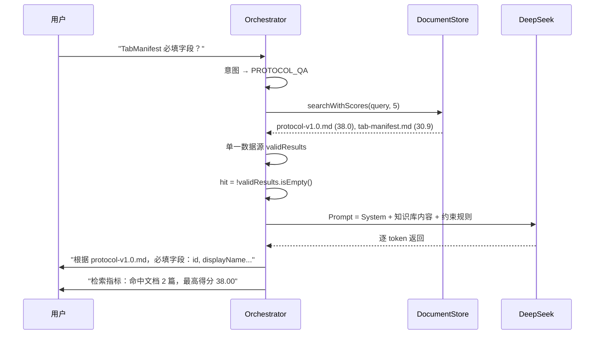
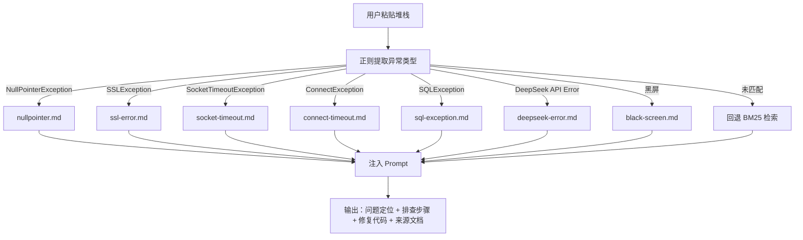
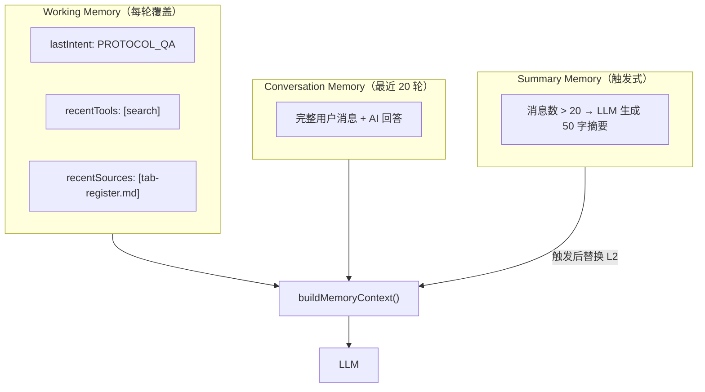
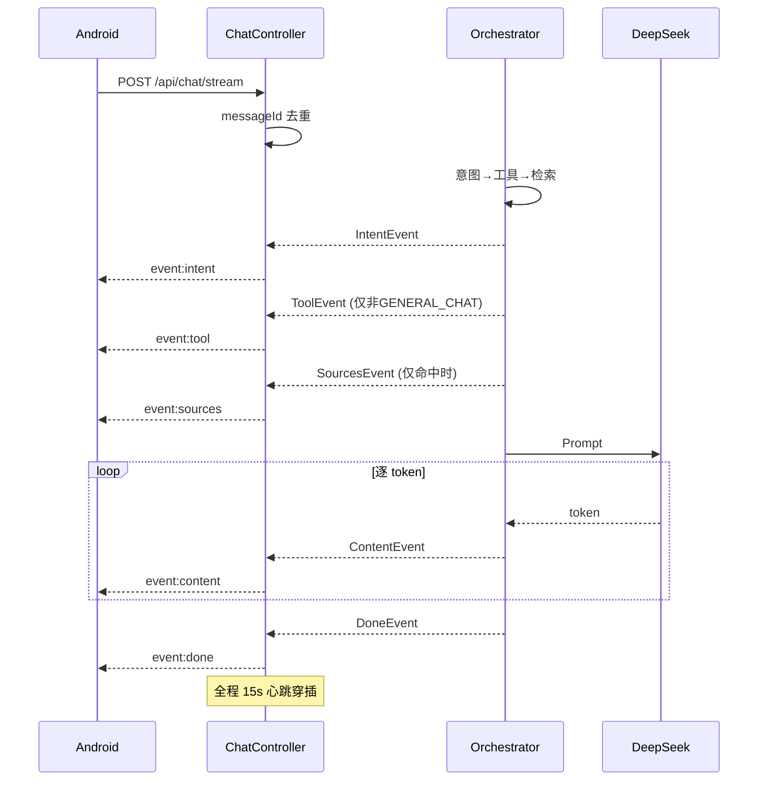

# AI OnCall Agent 答辩文档

# AI OnCall Agent —— 答辩报告

> 答辩人：李显鑫 | 模块：AI Agent 全链路（后端 + Android SSE 适配）
> 答辩时长：5 分钟 | 代码量：10 个核心文件，约 1400 行

---

## 5 分钟讲解路线

| 时间 | 讲什么 | 怎么讲 |
|------|--------|--------|
| 0:00-0:30 | 开场：我们做的不是聊天机器人 | 一句话定调 → 四个亮点预览 |
| 0:30-1:30 | 亮点一：RAG + Sources 追溯 | 讲 Bug 排查故事，展示架构修复 |
| 1:30-2:15 | 亮点二：错误诊断 | 讲场景痛点，展示 AnalyzeLogTool 流程 |
| 2:15-3:00 | 亮点三：三层 Memory | 讲"那生命周期呢"的指代消解 |
| 3:00-4:00 | 亮点四：SSE 流式防御 | 讲心跳为什么 15 秒、7 层防护 |
| 4:00-5:00 | 总结 + 追问预判 | 对比普通聊天机器人，展示成果 |

---

## 一、开场（30 秒）

```text
我做的不是一个调用大模型 API 的聊天机器人。

聊天机器人：你问它答，答对答错没法验证。
AI Agent：有知识库、有记忆、有工具、答案可追溯来源。

下面讲四个我们在开发中真实遇到并解决的问题。
```

**四个亮点预览**：

| # | 亮点 | 一句话 |
|---|------|--------|
| 一 | RAG 知识库 + 来源可追溯 | 从"AI 胡编"到"每条回答引用来历" |
| 二 | 错误日志自动诊断 | 从"复制堆栈→百度→试错"到"粘贴→秒出方案" |
| 三 | 三层 Memory 上下文记忆 | 用户追问"那生命周期呢"，Agent 知道"那"指 Tab |
| 四 | SSE 流式 + 7 层防御 | 逐字推送、断线自动恢复、用户无感知 |

---

## 二、亮点一：RAG 知识库 + 来源可追溯

### 2.1 问题：AI 凭什么说它是对的？

```text
普通聊天：用户 → DeepSeek → 回答（来源不明，可能胡编）
我们的 Agent：用户 → 知识库检索 → 检索结果注入 Prompt → DeepSeek 基于文档回答
```

### 2.2 知识库规模

| 指标 | 数值 |
|------|------|
| 文档数 | 43 篇 Markdown（protocol / api / troubleshooting / code-template / faq / android-sdk） |
| Chunk 数 | 494 个 |
| 切分策略 | 按 `##` 标题切分 + 超过 800 字符按空行再切 |
| 检索算法 | BM25 自实现（`DocumentStore.java`，250 行），零外部依赖 |
| 中文分词 | unigram + bigram 混合，英文整词保留（`tokenize()` 方法，行 160-187） |

### 2.3 核心流程



### 2.4 踩过最大的坑

**现象**：问 "OpenAI 创始人是谁"，系统输出——

```
【知识库未命中】
本次检索：命中文档 5 篇，BM25 最高得分 8.97
```

"未命中"同时"命中 5 篇"——自相矛盾。

**根因**（`DocumentAgentOrchestrator.java`，排查约 2 小时）：

```
hit 判定 ← toolResult.getBm25MaxScore()，阈值 3.0（行 94-96 旧代码）
sourceItems ← documentStore.searchWithScores()，阈值 0.5（行 108-109 旧代码）
```

两套数据源 + 两套阈值 → 得分在 0.5~2.99 之间时矛盾爆发。

**修复**（行 98-108，当前代码）：

```java
// 只检索一次，只过滤一次
List<SearchResult> validResults = documentStore.searchWithScores(message, TOP_K)
    .stream().filter(r -> r.getScore() >= 0.5).collect(Collectors.toList());

// hit 和 sourceItems 来自同一份数据
boolean hit = !tooShort && !validResults.isEmpty();
sourceItems = validResults.stream().map(...).collect();
```

### 2.5 命中/未命中分流

| 场景 | 行为 | 效果 |
|------|------|------|
| 知识库命中 | ruleBlock = "必须依据知识库，引用来源文件名" | 回答标注来源文档 |
| 知识库未命中 | ruleBlock = "标注【知识库未命中】，用训练知识回答" | 诚实告知，不假装有来源 |
| ≤3 个中文字 | 强制跳过检索 | "你好""谢谢"不浪费 CPU |
| GENERAL_CHAT | intentToTool → "none"，跳过 SearchTool | "OpenAI 创始人"不搜协议文档 |

**关键代码位置**：`DocumentAgentOrchestrator.java` 行 110-116（短查询跳过）、行 150-160（ruleBlock 切换）、行 101-102（哨兵模式）。

### 2.6 线上实时数据

```
GET /api/chat/metrics → {"totalSearches":49,"hitCount":28,"missCount":21,"hitRate":"57.14%","avgLatencyMs":"16.1"}
```

> **追问预判**：为什么不用向量数据库？→ 43 篇文档 BM25 够用，向量数据库需 GPU + Embedding API，ROI 不划算。
> **追问预判**：怎么证明不是胡编？→ SourcesEvent（结构化）+ 回答正文引用 + 检索指标行，三层证据链。

---

## 三、亮点二：错误日志自动诊断

### 3.1 问题

```text
开发中的真实场景：成员遇到异常 → 截图发群 → 等别人回复
流程：复制堆栈 → 百度 → CSDN → 试错 → 不行再问
耗时：30 分钟 ~ 2 小时
痛点：同一个 NPE，不同人反复问
```

### 3.2 设计：正则精确匹配 + BM25 回退



**关键代码**：`AnalyzeLogTool.java`（127 行），7 个 `LogPattern` 规则（行 11-58），正则命中 → confidence=0.85，未命中 → BM25 回退（行 84-100）。

### 3.3 演示效果

```
输入: NullPointerException at TabRegistry.java:82

输出:
  问题定位: TabRegistry.java:82 发生 NPE
  可能原因（来自 nullpointer.md）:
  1. Tab 对象在 register() 前未初始化
  2. registerTab() 在 onCreate() 前被调用
  排查步骤:
  ① 检查 registerTab() 调用时机
  ② 添加 null 检查
  来源: troubleshooting/nullpointer.md
```

> **追问预判**：和直接问 ChatGPT 有什么区别？→ ChatGPT 给通用 NPE 方案，我们给 OpenTab 项目中的真实排查经验。

---

## 四、亮点三：三层 Memory 上下文记忆

### 4.1 问题：LLM 是无状态的

```text
用户: Tab 怎么注册？
AI: 注册分静态注册和动态注册...

用户: 那生命周期呢？
AI: 请问您指的是什么的生命周期？  ← 不知道"那"指什么
```

### 4.2 三层架构（`Conversation.java` 144 行）



### 4.3 指代消解原理

```text
Q1: "Tab 怎么注册？"
  → Working Memory 记录: recentSources=[tab-register.md], lastIntent=PROTOCOL_QA

Q2: "那生命周期呢？"
  → buildMemoryContext() 输出:
    【最近来源文档】tab-register.md
    【最近对话】用户: Tab怎么注册？ AI: Tab注册分静态注册和动态注册...
  → LLM 看到上述上下文 → 推断"那" = Tab → 回答 Tab 生命周期
```

**关键代码**：`Orchestrator` 行 133-136（`addTool` / `addSource` 写入 Working Memory），`Conversation.java` 行 70-110（`buildMemoryContext` 注入 Prompt）。

> **追问预判**：Token 会不会无限增长？→ 超过 20 轮自动触发 Summary Memory，之后只保留摘要 + 最近 5 轮，Token 稳定在 3000-5000。

---

## 五、亮点四：SSE 流式 + 7 层防御

### 5.1 为什么选择 SSE 而不是 WebSocket？

| 维度 | WebSocket | SSE |
|------|-----------|-----|
| 通信方向 | 双向 | 服务端 → 客户端单向 |
| AI 场景匹配 | 过度设计（客户端不需要推服务端） | 完美匹配（服务端持续推 token） |
| 代理兼容 | 部分代理不支持 | 所有 HTTP 代理原生支持 |

AI 对话是服务端单向推送 → SSE 就是为此设计的。

### 5.2 全链路事件流



### 5.3 7 层防护体系

| # | 防护 | 位置 | 解决 | 代码位置 |
|---|------|------|------|---------|
| ① | 15s 心跳 | 服务端 | SLB 60s 空闲断连 | `ChatController.java:66-71` |
| ② | 双重超时 | 服务端 | 建连失败 ≠ 读取超时 | `DeepSeekClient.java:43,63` |
| ③ | messageId 去重 | Controller | Android 重试重复处理 | `ChatController.java:56-62` |
| ④ | eventId 递增 | 服务端 | 事件唯一可追踪 | `ChatController.java:74` |
| ⑤ | buffer(8) | Android | 生产者快消费者慢 | `OpenOnCallRepository.kt:101` |
| ⑥ | RETRY_ 静默 | Android | 重连不打扰用户 | `OpenOnCallRepository.kt:105-108` |
| ⑦ | collapse 去重 | Android | 同段内容推送两遍 | `OpenOnCallPage.kt` |

### 5.4 心跳为什么是 15 秒？

```text
SLB 空闲超时 = 60s，心跳间隔 = 15s，60/15 = 4 次覆盖

即使用 SSE 注释行（.comment()），不是 data 事件：
  · 注释行 12 字节/次，每小时 2.8KB
  · 客户端 SSE 解析器自动跳过，零 CPU 开销
```

### 5.5 Android 端断线重连

`OnCallApiClient.kt` 行 84-123：最多 3 次重试，指数退避 1s → 2s → 4s。重试前发 RETRY_ 事件，Android UI 层静默吞掉，用户无感知。

> **追问预判**：为什么不用 WebSocket？→ AI 场景是单向推送，WebSocket 的双向能力用不上，且代理兼容性差。
> **追问预判**：心跳会不会增加带宽？→ 12 字节 × 4 次/分钟 = 每小时 2.8KB，忽略不计。

---

## 六、总结

### 6.1 对比：普通聊天机器人 vs AI OnCall Agent

| 维度 | 聊天机器人 | AI OnCall Agent |
|------|----------|----------------|
| 知识来源 | LLM 训练数据 | 企业知识库 43 篇文档 |
| 回答可信度 | 无法验证 | SourcesEvent + 检索指标 |
| 错误诊断 | GPT 通用回答 | 7 种异常精确匹配 + 排查步骤 |
| 多轮对话 | 每次全新 | 三层 Memory，理解指代 |
| 流式输出 | 等 10 秒 | 逐字推送 + 7 层防御 |
| 工具能力 | 无 | Search / AnalyzeLog / GenerateCode |

### 6.2 核心文件改动

| 文件 | 行数 | 核心改动 |
|------|------|---------|
| `DocumentAgentOrchestrator.java` | 294 | 单一数据源 validResults、命中/未命中分流、哨兵模式 |
| `DocumentStore.java` | 250 | BM25 自实现、按 ## 标题切分、中英文混合分词 |
| `ChatController.java` | 125 | 15s 心跳、messageId 去重、eventId 递增 |
| `DeepSeekClient.java` | 183 | 双重超时、reasoning_content 过滤、SSE 解析 |
| `SearchTool.java` | 129 | 置信度四段映射 + 双加分项 |
| `AnalyzeLogTool.java` | 127 | 7 种异常正则匹配 + BM25 回退 |
| `Conversation.java` | 144 | 三层 Memory + buildMemoryContext |
| `ConversationStore.java` | 74 | messageId 去重存储 |
| `KnowledgeMetrics.java` | 47 | 实时检索指标 |
| `OpenOnCallRepository.kt` | — | buffer(8)、RETRY 过滤、SSE 解析 |

### 6.3 一句话收尾

```text
这不是"调了个大模型 API"。

这是在大模型之上构建了一套
有知识库、有记忆、会使用工具、可追溯来源的 Agent 系统。

每个设计背后都有一个真实遇到并解决的问题。
```
