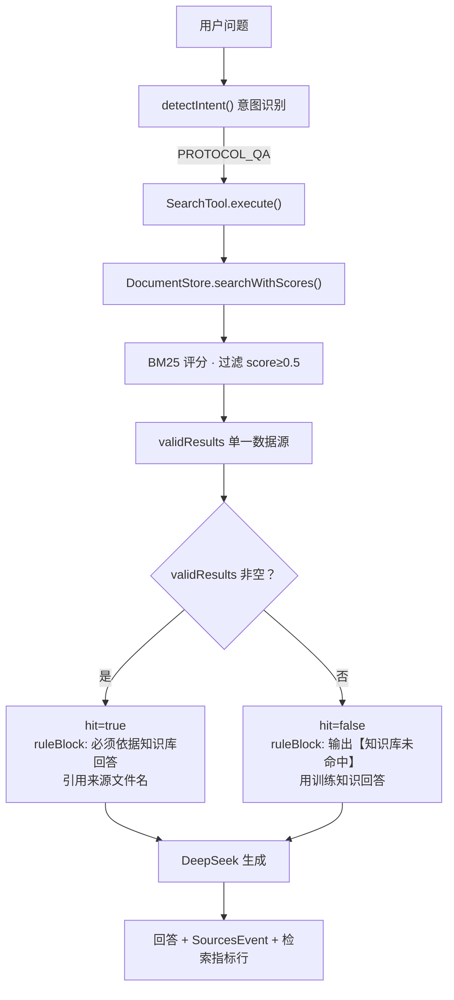
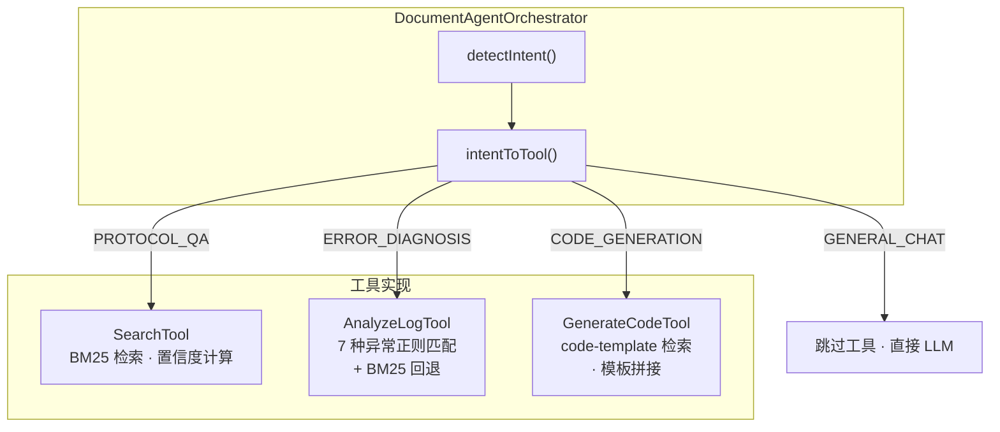
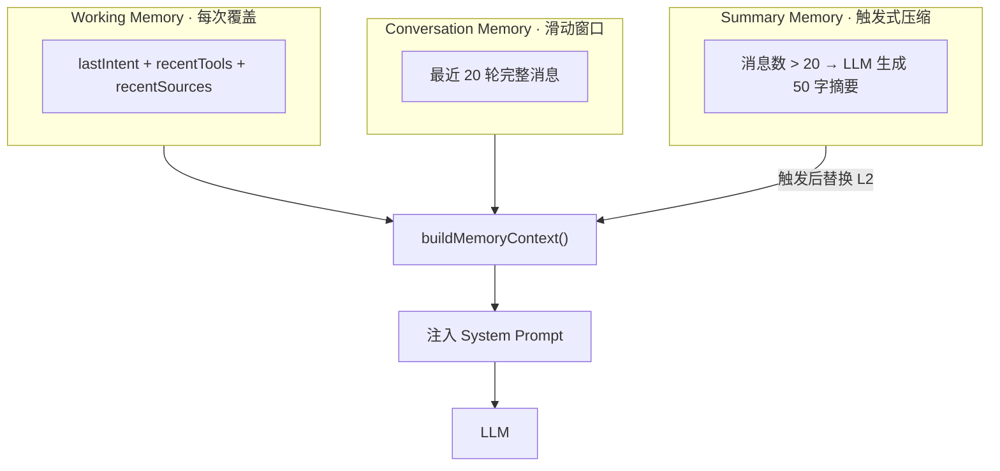
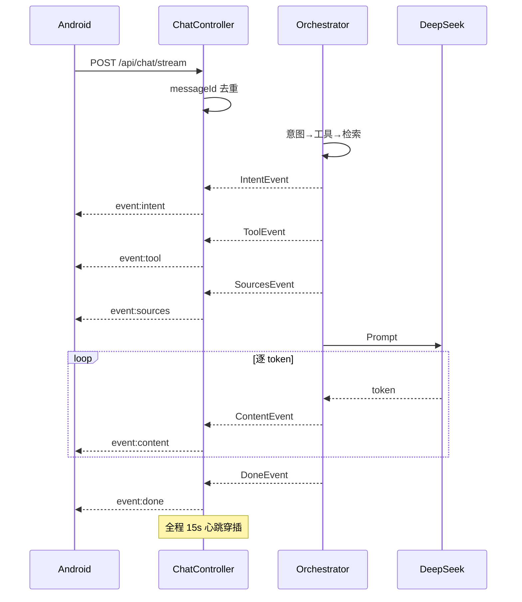

# AI 模块答辩

> 答辩人：李显鑫 | 时长：5 分钟

---

## 一句话定位

**AI OnCall 不是接了大模型 API 的聊天机器人。**

它是一套基于 **RAG 知识库 + Tool Calling 工具调用 + 三层 Memory 记忆 + SSE 流式事件架构** 构建的协议诊断 Agent。

为什么不是聊天机器人？因为聊天机器人你问它答，答对答错没法验证。Agent 的每一条回答都有来源文档、有检索得分、有可追溯的证据链。

---

# 亮点一：让 AI 回答有依据，而不是胡编

## 问题

直接问 DeepSeek "TabManifest 必填字段有哪些"，它会回答——但字段列表可能来自它的训练数据里某个不相干的框架，而不是我们的协议文档。

在企业场景里，**AI 回答不可信 = 不能用**。

## 为什么 Prompt 约束不够

很多人的思路是写 Prompt："请根据知识库回答，不要编造"。但 LLM 不总是听话——知识库里没有答案时，它仍然会"编一个看起来合理的"。Prompt 是软约束，我们需要**硬约束**。

## 我们的方案：代码层控制，不是 Prompt 层祈祷



**核心思路**：不是让 LLM 自己判断"知识库有没有答案"，而是**代码层先判断**，然后用 `hit` 布尔值切换两套不同的 Prompt 模板。

## 核心实现

**DocumentStore.java**（250 行）：BM25 自实现。43 篇 Markdown 按 `##` 标题切分为 494 个 chunk。中文用 unigram + bigram，英文整词保留，零外部依赖。

**DocumentAgentOrchestrator.java**（294 行，行 98-108）：单一数据源 `validResults`。hit 判定和 sourceItems 都来自同一次检索结果：

```java
// 只检索一次
List<SearchResult> validResults = documentStore.searchWithScores(message, 5)
    .stream().filter(r -> r.getScore() >= 0.5).toList();

// hit 和 sourceItems 来自同一份数据
boolean hit = !tooShort && !validResults.isEmpty();
List<SourceItem> sourceItems = validResults.stream()...;
```

## 踩坑：命中 5 篇却显示未命中

**现象**：问"OpenAI 创始人是谁"，输出 `【知识库未命中】` 同时显示 `命中文档 5 篇，BM25 得分 8.97`。

**根因**：旧代码里 hit 判定和 sourceItems 用了**两套不同的数据源 + 两套不同的阈值**。hit 用 toolResult（阈值 3.0），sourceItems 用 searchWithScores（阈值 0.5）。得分在 0.5~2.99 之间时矛盾爆发。

**修复**：不是调阈值，是重构成单一数据源。只检索一次，hit 和 sourceItems 同源。

## 效果

| 修复前 | 修复后 |
|--------|--------|
| "未命中" 同时 "命中 5 篇" | hit=false → sourceItems 一定为空 |
| 得分永远显示 0.00 | BM25 真实得分 0~50+ |
| LLM 自己判断是否命中 | 代码层硬约束，切换 Prompt 模板 |

**老师印象**：这个学生不是"用了 RAG"，而是解决了 RAG 的核心矛盾——检索结果和回答策略的一致性。

**追问预判**：
- Q: 为什么不用向量数据库？→ 43 篇文档 BM25 够用，向量数据库需 GPU + Embedding API，ROI 不划算。
- Q: 怎么证明回答不是胡编？→ SourcesEvent（结构化）+ 回答引用 + 检索指标行，三层证据链。

---

# 亮点二：让 AI 具备工具调用能力，不只是聊天

## 问题

普通 AI 对话：
```
用户输入 → LLM → 回答
```

用户贴一段 NPE 堆栈，ChatGPT 会给通用的排查建议——"检查对象是否为空""加 try-catch"。但这些建议**不来自我们的项目经验**，不知道 Tab 注册时序才是真正常见根因。

## 为什么仅靠 Prompt 不够

Prompt 可以让 LLM "假装"调用工具——但它不会真的去检索文档、不会真的去匹配错误模式。**假 Tool 和真 Tool 的区别就是幻觉和真实的区别。**

## 我们的方案：代码层真实执行工具



**关键设计**：每个工具返回统一的 `ToolResult`（含 summary + sources + detailData + confidence），Orchestrator 不关心工具内部实现，只对接接口。

## AnalyzeLogTool 细节（`AnalyzeLogTool.java` 127 行）

**第一层：正则精确匹配**（行 11-58）。7 种异常各对应一个排查文档：

| 异常 | 正则 | 命中文档 |
|------|------|---------|
| NullPointerException | `NPE\|null pointer` | nullpointer.md |
| SSLException | `SSLException\|cert.*verify` | ssl-error.md |
| SocketTimeout | `SocketTimeout\|Read timed out` | socket-timeout.md |
| ConnectException | `Connection refused\|ConnectException` | connect-timeout.md |
| SQLException | `SQLException\|Duplicate entry\|Deadlock` | sql-exception.md |
| 黑屏 | `黑屏\|black.?screen` | black-screen.md |
| DeepSeek API Error | `DeepSeek\|401\|api.?error` | deepseek-error.md |

**第二层：BM25 回退**（行 84-100）。正则没命中时，用 BM25 检索 troubleshooting 目录。

**注入 Prompt**（行 110-120）：分析结果作为 detailData 注入 LLM，附指令要求输出「问题定位 → 根因分析 → 修复方案 → 预防措施」。

## 演示效果

```
输入: NullPointerException at TabRegistry.java:82

输出:
  问题定位: TabRegistry.java:82 行发生 NPE
  根因分析: Tab 对象在 register() 前未初始化
  修复方案: 将 registerTab() 移至 Tab.onCreate() 之后
  预防措施: 添加 @Nullable 注解 + null 检查
  来源: troubleshooting/nullpointer.md
```

**老师印象**：这个 Agent 真的会"使用工具"——不是靠 Prompt 引导 LLM 假装调用，而是代码层真实执行。

**追问预判**：
- Q: 这和 Function Calling 有什么区别？→ Function Calling 是 LLM 决定调哪个工具，我们是指令式调度（代码层先判断意图再选工具），更可控、更省 token。

---

# 亮点三：让 AI 记住上下文

## 问题

LLM 无状态。每次调用都是一张白纸。

```
用户: Tab 怎么注册？
AI: 注册分静态注册和动态注册...

用户: 那生命周期呢？
AI: 请问您指的是什么的生命周期？  ← 不知道"那"指 Tab
```

如果把所有历史全塞进 Prompt——Token 线性增长，超过上下文窗口直接截断丢信息。

## 我们的方案：三层 Memory，各司其职



**Conversation.java**（144 行）的 `buildMemoryContext()` 方法（行 70-110）负责拼接三层 Memory。

## 指代消解原理

```
第 1 轮:
  用户: "Tab 怎么注册？"
  → Orchestrator 行 133-136: updatedConv.addSource("tab-register.md")
  → Working Memory: recentSources = [tab-register.md]

第 2 轮:
  用户: "那生命周期呢？"
  → buildMemoryContext() 输出:
    【最近来源文档】tab-register.md
    【最近对话】用户: Tab怎么注册？ AI: ...
  → LLM 看到上下文 → 推断 "那" = Tab → 回答 Tab 生命周期
```

## Token 控制

| 策略 | Token 消耗 |
|------|-----------|
| 无限拼接历史 | O(n) 线性增长，终将超限 |
| 三层 Memory（我们的） | 稳定在 3000-5000，不随轮数增长 |

`needsSummarization()`（Conversation.java 行 X）：消息数 ≥ 20 → 触发 Summary Memory → 之后只保留摘要 + 最近 5 轮精确消息。

**老师印象**：不是简单的"把历史消息存起来"，而是分层管理——短期精确、中期上下文、长期压缩。这是 Agent 架构的标准设计模式。

**追问预判**：
- Q: 为什么不直接拼所有历史进 Prompt？→ Token 无限增长 + 无关历史干扰注意力。
- Q: Summary Memory 什么时候触发？→ 消息数 > 20 轮时异步生成，不阻塞用户请求。

---

# 加分亮点：SSE 流式架构

## 为什么不是普通 HTTP？

普通 HTTP：用户发请求 → 等 5-10 秒 → 一次性返回。用户盯着空白屏幕，中间出错全部白等。

我们的 SSE：用户发请求 → 立即收到 IntentEvent → ToolEvent → SourcesEvent → 逐 token ContentEvent → DoneEvent。

## 全链路时序



## 防御设计

| # | 防护 | 位置 | 代码 |
|---|------|------|------|
| ① | 15s 心跳（`.comment()` 零开销） | ChatController:66-71 | `Flux.interval(15s).map(i -> .comment("keepalive"))` |
| ② | connectTimeout 30s + readTimeout 60s | DeepSeekClient:43,63 | 两种超时保护两种不同故障 |
| ③ | messageId 去重 | ChatController:56-62 | Controller 层拦截，不进业务 |
| ④ | buffer(8) 背压 | OpenOnCallRepository.kt:101 | 吸收 DeepSeek 突发 token |
| ⑤ | RETRY_ 静默 | OpenOnCallRepository.kt:105-108 | 断线重连用户无感 |

**追问预判**：
- Q: 为什么不用 WebSocket？→ AI 是单向推送，SSE 更轻量，代理兼容性更好。
- Q: 心跳为什么 15 秒？→ SLB 超时 60s，15s × 4 = 60s，即使丢 2 个包也不断。

---

# 5 分钟答辩话术

> 以下可直接照着讲，控制在 5 分钟以内。

---

**（0:00-0:20）开场**

我做的是一个 AI Agent，不是聊天机器人。

聊天机器人你问它答，答对答错没法验证。Agent 的每一条回答都有来源文档、有检索得分、能追溯到具体文件的哪个章节。

我讲三个我们在开发中真实遇到的问题和怎么解决的。

---

**（0:20-1:20）亮点一：让 AI 回答有依据**

第一个问题——AI 胡编。

直接问 DeepSeek "TabManifest 必填字段有哪些"，它会回答，但字段列表可能来自训练数据里某个不相干的框架。在企业场景里，AI 回答不可信就不能用。

我们的方案不是写 Prompt 让它"别编"，而是代码层做硬约束。

具体做法：用户问题进来，先做意图识别，再走 SearchTool 调 BM25 检索 43 篇知识库文档。关键设计是——代码层先判断"知识库有没有命中"，然后用 hit 布尔值给 LLM 发两套不同的 Prompt 模板。命中就强制引用文档，没命中就诚实标注【知识库未命中】。

踩过一个坑：部署后发现"未命中"的同时又显示"命中文档 5 篇"。排查两个多小时发现——旧代码里 hit 判定和来源列表用了两套不同的数据源和两套不同的阈值。修复方案不是调阈值，是重构成单一数据源。

现在每条回答都有三层证据链：结构化的 SourcesEvent、回答正文自然引用、末尾检索指标行。问"TabManifest 必填字段"会标注根据 protocol-v1.0.md。

---

**（1:20-2:10）亮点二：让 AI 能诊断错误**

第二个问题——普通 AI 不能诊断项目特有的错误。

用户贴一段 NPE 堆栈，ChatGPT 给的建议是"检查对象是否为空"，但它不知道我们项目里 NPE 最常见的原因是 Tab 注册时序不对。

我们做了 AnalyzeLogTool——不是让 LLM 猜，是让代码先精确匹配。七种异常类型各对应一个排查文档，里面是我们项目维护者写的真实经验。正则先匹配，匹配不到才回退到 BM25 搜索。

用户粘贴 NullPointerException at TabRegistry.java:82，它会输出：问题定位在 TabRegistry 第 82 行、根因是 registerTab 在 onCreate 前被调用、修复方案是把调用移到 onCreate 之后、来源是 nullpointer.md。

这不是 Prompt 工程，是真实的工具调用。

---

**（2:10-3:00）亮点三：让 AI 记住上下文**

第三个问题——LLM 是无状态的。

用户问"Tab 怎么注册"，再问"那生命周期呢"，普通 AI 不知道"那"指什么。

我们做了三层 Memory。最核心的是 Working Memory——每轮回答完记录用了什么工具、命中了什么文档。下一轮 buildMemoryContext 的时候把信息注入 Prompt。LLM 看到上一轮命中了 tab-register.md，就能推断"那"指的是 Tab。

超过 20 轮对话自动触发 Summary Memory 做压缩，Token 用量不随轮数增长。

---

**（3:00-3:40）加分：SSE 流式**

最后快速说一下流式架构。

一般 HTTP 是用户等 5 到 10 秒一次性看到结果。我们用的是 SSE，五种事件按顺序推送：Intent、Tool、Sources、Content 逐 token、Done。

最关键的防御是心跳——每 15 秒发一个 SSE 注释包。为什么是 15 秒？因为阿里云 SLB 60 秒没数据就断连，15 秒发一次，60 秒内四次心跳，即使丢两个包也不断。这个包用的是 SSE 注释行，客户端自动跳过，零开销。

---

**（3:40-4:00）收尾**

总结。这不是一个调了 DeepSeek API 的聊天机器人。这是在大模型之上加了一层知识库检索、一层工具调用、一层记忆管理、一层流式防御的 Agent 系统。每个设计都有它要解决的明确问题。

谢谢。

---

> 话术约 1300 字，正常语速 5 分钟内可讲完。每段之间可略停顿，给老师翻文档的时间。
