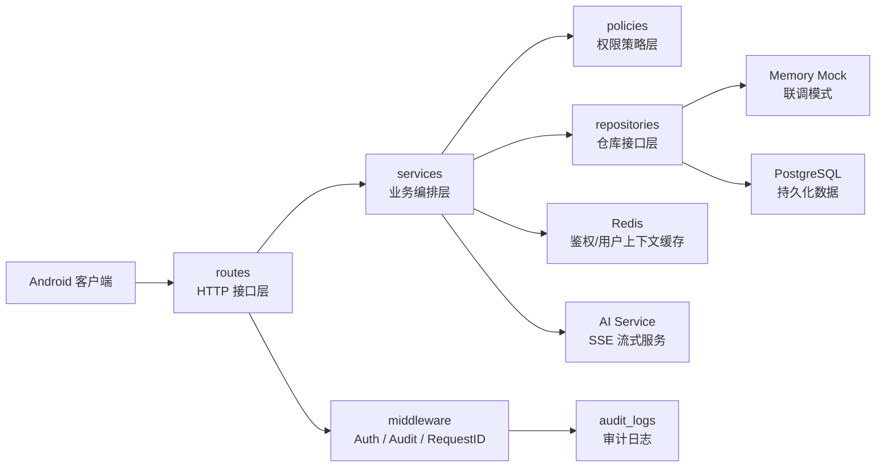
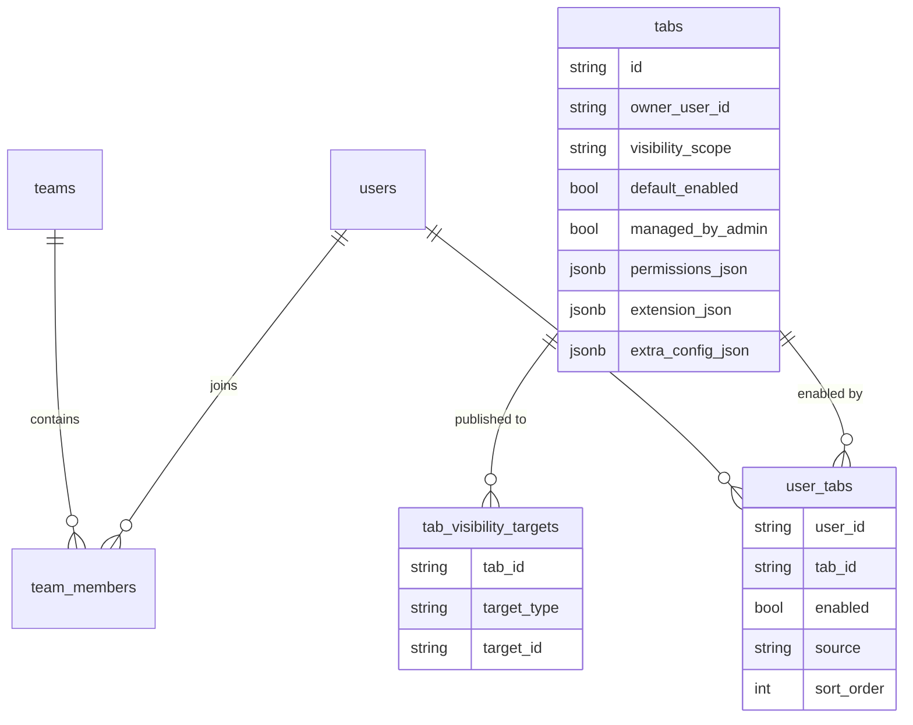
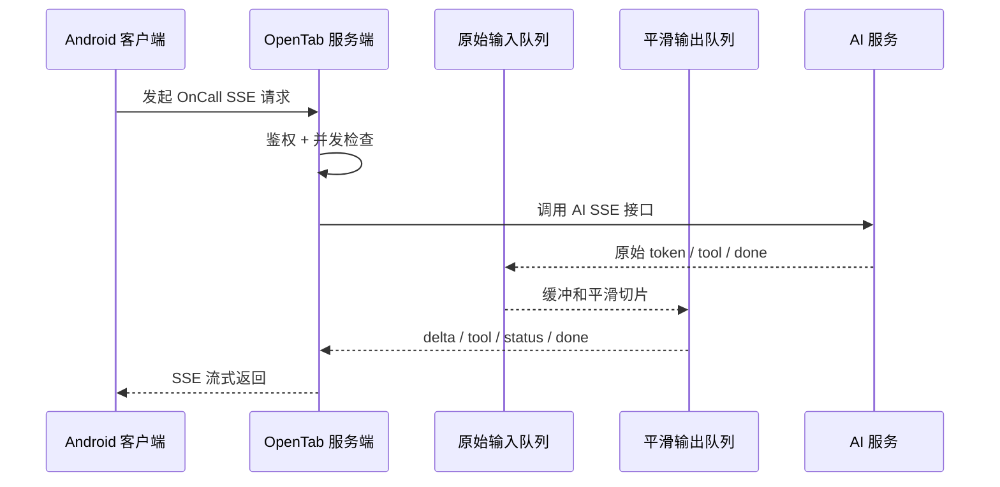

# OpenTab 服务端答辩亮点讲解稿

本文档按 5 分钟答辩节奏组织。主线不追求把所有代码细节讲完，而是先讲清楚服务端设计思路，把细节留给评委追问时展开。

## 一、核心亮点

我建议答辩时重点讲 5 个亮点：

1. **整体架构**
   - 服务端采用分层架构和 Repository 模式，支持 Memory Mock 与 PostgreSQL 切换，保证客户端联调和后期真实数据库部署之间接口稳定。

2. **登录鉴权**
   - 使用 Bearer Token + 服务端 session 表管理登录态，支持 token 过期、logout 吊销，并引入 Redis 作为鉴权加速层。

3. **权限控制**
   - 把权限从“接口级”提升到“资源级”，Tab、团队、审批、日程等接口都基于当前用户、团队关系和权限码做服务端兜底判断。

4. **查询性能优化**
   - 针对列表接口做 N+1 查询优化，并用 Redis 缓存高频鉴权上下文，减少重复数据库查询。

5. **AI OnCall 流式输出优化**
   - 服务端对 AI SSE 做并发控制、取消生成、心跳、双缓冲平滑输出和失败降级，提升流式对话稳定性。

可以作为补充回答的第 6 点：

6. **可观测性与测试**
   - 通过 request_id、审计日志、健康检查、debug status 和单元测试证明系统行为可追踪、可验证。

## 二、系统架构图



答辩时可以这样讲：

> 我这个服务端不是简单把接口堆在路由里，而是拆成 routes、services、repositories、policies、middleware 几层。路由层处理 HTTP，服务层处理业务流程，策略层集中处理权限，仓库层隔离 Memory 和 PostgreSQL。这样前期可以用 Mock 支撑客户端联调，后期接入 PostgreSQL 和 Redis 时，客户端接口不需要跟着大改。

## 三、亮点一：整体架构

### 我做了什么

服务端主要分成：

- `routes`：HTTP 请求和响应。
- `middleware`：鉴权、审计、请求 ID。
- `services`：登录、Tab、审批、日程、AI 会话等业务编排。
- `policies`：权限和可见性规则。
- `repositories`：数据访问接口。
- `database/models`：数据库表结构和数据模型。

其中比较关键的是 Repository 模式。服务端不是直接在 service 里写死数据库操作，而是定义了一组仓库接口：

```text
RepositorySet
  Users
  Tabs
  Business
  OnCall
  Debug
  Audit
```

每类仓库都有 Memory 实现和 PostgreSQL 实现。启动时通过环境变量切换：

```text
APP_MODE=mock
APP_MODE=postgres
```

### 这样做的好处

- 前期客户端没完全做好时，可以用 Memory Mock 快速联调。
- 接入 PostgreSQL 后，接口格式不用改。
- 单元测试可以直接用 memory，速度快。
- 数据访问和业务逻辑分离，后续扩展表结构或缓存更清晰。

### 答辩讲法

> 我在架构上做了一个比较清晰的分层。服务层不直接关心数据来自内存还是 PostgreSQL，而是通过 Repository 接口访问数据。这样前期能快速做 Mock 联调，后期能切到真实数据库，同时客户端接口保持稳定。这一点对团队并行开发比较重要。

## 四、亮点二：登录鉴权

### 我做了什么

登录成功后，服务端生成随机 token，并写入 `auth_sessions` 表：

```text
token
user_id
expires_at
revoked_at
```

客户端后续请求都带：

```http
Authorization: Bearer token
```

服务端每次请求会做：

```text
1. 校验 token 是否存在
2. 判断 token 是否过期
3. 判断 token 是否被 logout 吊销
4. 查询用户权限和团队关系
5. 组装 CurrentUser 放入 Gin Context
```

logout 时不会只让客户端清 token，而是服务端把 session 标记为 revoked。这样即使旧 token 被再次拿来调用接口，也会被拒绝。

### Redis 优化

后面我又加了 Redis，但 Redis 不是替代 PostgreSQL，而是作为加速层：

```text
auth:session:{tokenHash}
auth:userctx:{userId}
```

缓存两类数据：

- token 对应的 session 信息。
- 当前用户上下文，包括权限码和团队关系。

Redis 失败时服务端会自动回退 PostgreSQL，不影响接口正确性。权限或团队发生变化时，服务端会主动删除对应用户缓存，避免权限缓存不一致。

### 这样做的好处

- token 不再是永久固定值。
- logout 可以真正吊销 token。
- Redis 减少高频鉴权查询。
- Redis 异常不影响系统主流程。
- 权限变更后缓存会主动失效，避免旧权限继续生效。

### 答辩讲法

> 鉴权这块我没有只做一个固定 token，而是用服务端 session 管理登录态。token 有过期时间，logout 会吊销。后面我又加了 Redis 缓存 session 和 CurrentUser，减少每次请求都查数据库的成本。但 Redis 只是加速层，真实状态仍然以 PostgreSQL 为准，权限变更时会主动清理缓存。

## 五、亮点三：权限控制

### 权限不是只看接口

这个项目的权限控制重点不是“能不能访问某个接口”，而是“能不能访问某个具体资源”。

比如同样是：

```http
POST /me/tabs
```

用户能启用公开 Tab，但不能启用管理员只发布给其他团队的 Tab。

### Tab 权限模型

Tab 的可见性由几类信息共同决定：

```text
1. 是否系统 Tab
2. 是否用户自己创建
3. 是否发布到 company
4. 是否发布到当前用户所在 team
5. 是否发布到指定 user
6. 用户是否有对应 permission code
```

数据上拆成几张表：



### 团队权限和单团队一致性

团队成员关系由 `team_members` 管理。我们当前阶段设定为：

```text
一个用户最多只有一个启用中的团队
```

因此我做了服务端兜底：管理员把成员加入新团队时，服务端会自动把该用户其他团队关系置为 `enabled=false`，再启用新团队关系。这样即使客户端没有先调用“移出旧团队”，服务端也能保证数据一致。

### 这样做的好处

- 防止客户端隐藏入口但接口仍可越权调用。
- 权限规则集中在策略层，后续扩展角色更清晰。
- Tab 的发布范围和用户启用状态分开，支持默认发布和用户主动停用。
- 团队成员关系由服务端兜底，避免前端漏调接口导致用户同时属于多个团队。

### 答辩讲法

> 权限控制这块我重点做的是资源级权限。服务端不会因为用户登录了就默认允许访问所有 Tab 或业务数据，而是会结合当前用户、团队关系、发布范围和权限码判断。比如管理员把 Tab 发布到某个团队，服务端会保证只有目标团队能看到。团队成员管理上，我也让服务端保证一个用户最多只有一个启用团队，避免客户端操作不完整导致数据不一致。

## 六、亮点四：查询性能优化

### 我解决了什么问题

后端列表接口很容易出现 N+1 查询。比如最近 AI 会话列表，原来逻辑是：

```text
查会话列表 1 次
每个会话再 count 一次消息数
```

如果有 20 个会话，就会变成 21 次查询。

我把它改成：

```text
查会话列表 1 次
GROUP BY session_id 批量统计消息数 1 次
```

这样不管会话数量多少，查询次数基本固定。

### 同类优化

除了 AI 最近会话，我也检查并优化了其他类似场景：

- 团队列表：成员数、主管数从逐团队 count 改成批量聚合。
- 审批列表：teamName 从逐条查改成批量查询。
- 日程列表：teamName 从逐条查改成批量查询。
- 公告列表：teamName 从逐条查改成批量查询。
- 管理员用户列表：memberships 从逐用户查改成批量查询。

### Redis 和查询性能

Redis 主要优化的是高频鉴权路径。因为每个受保护接口都会鉴权，如果每次都完整查 session、用户、权限、团队关系，会产生重复查询。

现在流程是：

```text
优先查 Redis
Redis miss 再查 PostgreSQL
查到后写回 Redis
权限/团队变化时主动删除缓存
```

### 这样做的好处

- 列表接口查询次数更稳定。
- 用户越多、会话越多时，不会线性放大数据库查询。
- 高频鉴权请求减少重复查库。
- Redis 不改变接口，不影响客户端。

### 答辩讲法

> 性能优化上，我主要做了两件事。第一是排查列表接口里的 N+1 查询，把逐条 count 或逐条查关联信息改成批量聚合查询。第二是引入 Redis 缓存鉴权上下文，减少每个接口重复查询 session、权限和团队关系。这里我没有把 Redis 当成主数据源，而是加速层，权限变更时会主动失效缓存。

如果评委追问细节，可以展开：

```text
AI 最近会话：COUNT(*) GROUP BY session_id
团队统计：COUNT + SUM(CASE WHEN team_role='manager')
鉴权缓存：token session + user context
缓存一致性：权限/团队变更后 DEL userctx
```

## 七、亮点五：AI OnCall 流式输出优化

### 流式链路



### 我做了哪些优化

1. **全局并发限制**
   - 防止太多 AI 请求同时压垮服务。

2. **用户级并发限制**
   - 默认同一用户同一时间只保留一个 AI 生成任务。

3. **同一会话重复生成自动取消旧任务**
   - 用户重复点击时，旧生成任务会被取消，避免同一会话写入两份回答。

4. **取消生成**
   - 客户端调用 cancel 后，服务端取消 context，停止继续转发 AI 输出。

5. **心跳**
   - 长时间没有业务数据时发送 heartbeat，避免客户端误以为 SSE 连接断开。

6. **双缓冲平滑输出**
   - AI 原始输出先进入 rawBuffer，再由 StreamSmoother 按固定节奏输出给客户端。
   - AI 突然输出一大段时，客户端显示不会突然跳一大块。

7. **失败降级**
   - AI 服务不可用或还没输出有效业务内容时，服务端可以返回兼容格式的兜底事件，避免客户端直接中断。

### 答辩讲法

> AI OnCall 这块我没有只做简单转发。因为流式接口在真实使用时会遇到慢响应、重复点击、取消生成、AI 服务异常等问题，所以我在服务端做了并发限制、取消生成、心跳、双缓冲平滑输出和失败降级。双缓冲的作用是把 AI 原始输出和客户端展示节奏解耦，让客户端看到的输出更加稳定。

如果评委追问“平滑输出具体是什么”，可以回答：

> AI 服务的输出不是直接原样推给客户端，而是先进入原始队列，再由 smoother 按固定间隔和固定 chunk 大小推送。这样 AI 输出一大段时，客户端仍然能以比较平滑的节奏展示；AI 短暂停顿时，服务端也能维持连接状态。

## 八、补充亮点：可观测性与测试

如果时间够，可以最后补一句：

> 除了业务接口，我还做了 request_id、审计日志、健康检查和 debug status。测试上覆盖了登录注册、Token 吊销、Tab 权限、业务数据隔离、AI 流式输出、团队成员单团队一致性等场景。这样服务端不是只靠手动点页面验证，而是有自动化测试兜底。

可以提到：

```text
GET /health
GET /debug/status
audit_logs
go test ./...
```

## 九、5 分钟演讲稿

各位老师好，我负责的是 OpenTab 项目的服务端部分。服务端主要提供账号登录、Token 校验、Tab 注册和发布、审批日程等业务接口、AI OnCall 会话管理和消息存储。

我在实现时重点考虑的是：这个服务端不能只是简单返回 Mock 数据，而是要支撑一个开放式 Tab 容器。开放式 Tab 的特点是 Tab 可以动态创建、动态发布，所以服务端必须负责安全边界、数据隔离和状态一致性。

第一个亮点是整体架构。服务端采用 Go + Gin，并按 routes、middleware、services、repositories、policies、database 分层。routes 负责 HTTP 请求，services 编排业务，policies 统一处理权限，repositories 负责数据访问。Repository 层同时有 Memory 和 PostgreSQL 两套实现。这样前期可以用 Memory Mock 支撑客户端联调，后期切到 PostgreSQL 后，客户端接口格式不需要变化。

第二个亮点是登录鉴权。登录成功后，服务端生成随机 token，并把 token、user_id、过期时间和吊销时间保存到 auth_sessions。客户端后续请求都带 Bearer Token。服务端每次请求会校验 token 是否存在、是否过期、是否被 logout 吊销，然后组装 CurrentUser。后面我又引入 Redis 缓存 session 和用户上下文，减少每次请求重复查数据库。Redis 只是加速层，真实状态仍然以 PostgreSQL 为准，权限变更时会主动清理缓存。

第三个亮点是权限控制。我把权限从接口级提升到了资源级。比如用户不是登录后就能启用所有 Tab，而是服务端会判断这个 Tab 是否是系统 Tab、是否由当前用户创建、是否发布到全公司、是否发布到当前用户所在团队或指定用户，以及用户是否拥有对应权限码。团队成员管理上，我也让服务端保证一个用户最多只有一个启用团队，避免客户端漏掉移出旧团队操作后造成数据不一致。

第四个亮点是查询性能优化。服务端列表接口里容易出现 N+1 查询，比如 AI 最近会话列表，原来查完会话后会对每个会话单独 count 消息数。我把它改成一次 GROUP BY 批量统计。类似地，团队成员统计、审批/日程/公告里的团队名称、管理员用户 memberships 也都改成批量查询。再结合 Redis 缓存鉴权上下文，减少高频接口的重复数据库查询。

第五个亮点是 AI OnCall 的流式输出优化。AI 流式接口在真实使用中会遇到输出慢、重复点击、取消生成、连接长时间无输出、AI 服务异常等问题。所以我在服务端做了全局并发限制、用户级并发限制、同一会话重复生成自动取消旧任务、取消生成、心跳、双缓冲平滑输出和失败降级。双缓冲的思路是 AI 原始输出先进入队列，再由 smoother 按固定节奏推给客户端，让客户端看到的输出更加平滑稳定。

最后，服务端还做了 request_id、审计日志、健康检查和 debug status，并通过单元测试覆盖登录鉴权、Tab 权限、AI 流式、业务数据隔离、团队成员一致性等场景。

总结来说，我这个服务端的核心思路是：客户端负责展示，服务端负责安全边界、状态一致性和稳定性。尤其是在开放式 Tab 和 AI 流式输出这两个场景下，后端需要做的不只是提供接口，还要兜住权限、数据隔离和异常场景。

## 十、可能追问与回答

### 1. 为什么要做 Repository 层？

因为项目早期需要 Mock 支撑客户端联调，后期又要切 PostgreSQL。如果 service 直接写数据库，切换成本很高。Repository 接口把数据来源隔离开，Memory 和 PostgreSQL 可以替换，接口层和业务层不用大改。

### 2. Redis 会不会导致权限不一致？

我没有把 Redis 当主数据源。Redis 只缓存 session 和用户上下文。权限、团队成员关系仍然以 PostgreSQL 为准。管理员修改团队、角色或权限后，服务端会主动删除对应用户的 user context 缓存，同时 TTL 也作为兜底。

### 3. 为什么要每次请求都鉴权？

HTTP 是无状态的，服务端不能默认“上一次请求登录过，这一次也可信”。每次请求带 token，服务端才能判断 token 是否过期、是否被吊销、权限是否变化。Redis 是为了减少这个过程里的重复查库。

### 4. 什么是资源级权限？

接口级权限只判断用户能不能访问接口。资源级权限会判断用户能不能访问这条具体数据。比如同样调用启用 Tab 接口，用户只能启用自己可见范围内的 Tab，不能通过猜 tabId 启用其他团队的 Tab。

### 5. 为什么不只靠客户端隐藏按钮？

客户端隐藏只能改善界面，不能保证安全。用户可以抓包或自己构造请求。服务端必须根据当前用户、团队、权限码和资源归属重新判断。

### 6. N+1 查询是什么？

就是先查出一个列表，然后对列表里每一条数据再单独查一次关联信息。数据量一多，查询次数就线性增长。我把这些场景改成批量查询或 GROUP BY 聚合。

### 7. AI 双缓冲有什么用？

它把 AI 服务输出节奏和客户端展示节奏解耦。AI 可能突然吐出一大段，也可能短暂停顿。双缓冲让服务端按稳定节奏输出，客户端体验更平滑。

### 8. 取消生成是怎么实现的？

服务端为活跃的 AI 流保存 cancel 函数。客户端调用取消接口后，服务端取消对应 context，停止继续读取 AI 输出，也停止向客户端推送。

### 9. 如果 AI 服务失败怎么办？

服务端会识别 AI 调用异常。如果还没有输出有效业务内容，可以降级返回兼容格式事件，避免客户端直接中断。已经输出业务内容后，会把错误事件转给客户端处理。

### 10. 目前还有哪些不足？

目前还没有做生产级 HTTPS 自动化、完整数据库迁移版本管理、复杂组织架构和更细粒度角色模型。当前重点是阶段项目要求下的接口联调、权限隔离、数据持久化和 AI 流式稳定性。

## 十一、提问时可以展开的代码位置

答辩时不需要主动逐行讲代码，但评委追问时可以打开这些文件：

```text
整体架构：
internal/routes/router.go
internal/repositories/repository_set.go

鉴权和 Redis：
internal/services/auth_service.go
internal/cache/redis_auth_cache.go
internal/middleware/auth.go

权限控制：
internal/policies/authorization.go
internal/policies/tab_policy.go
internal/repositories/postgres_tab_repository.go

查询性能优化：
internal/repositories/postgres_oncall_repository.go
internal/repositories/postgres_business_repository.go

AI 流式输出：
internal/services/oncall_service.go
internal/services/stream_smoother.go
internal/services/ai_limiter.go
```

## 十二、最终讲解策略

5 分钟内不要陷入表结构细节。建议节奏：

```text
0:00 - 0:40  项目职责和整体架构
0:40 - 1:30  登录鉴权和 Redis
1:30 - 2:30  权限控制和资源级访问
2:30 - 3:30  查询性能优化：N+1 + Redis
3:30 - 4:30  AI OnCall 流式输出优化
4:30 - 5:00  可观测性、测试和总结
```

核心表达：

> 我负责的服务端不是只提供接口，而是负责把开放式 Tab 和 AI OnCall 这两个模块里的安全边界、状态一致性和稳定性兜住。
