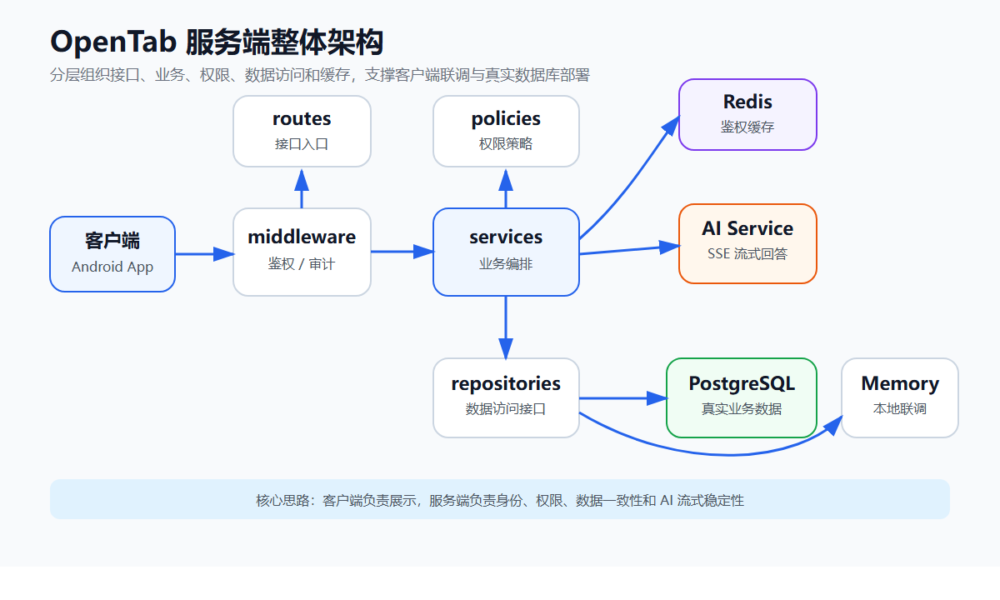
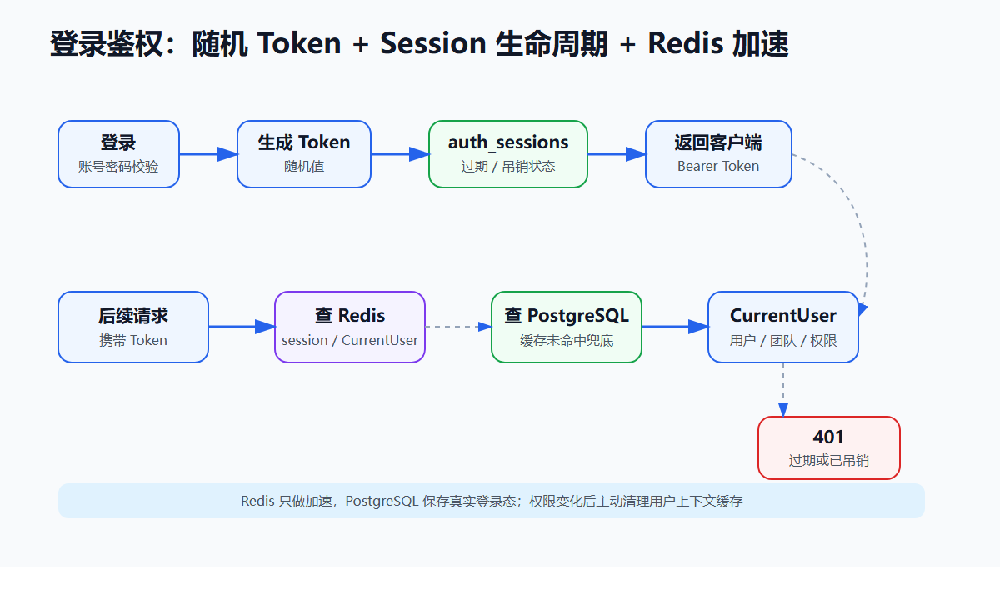
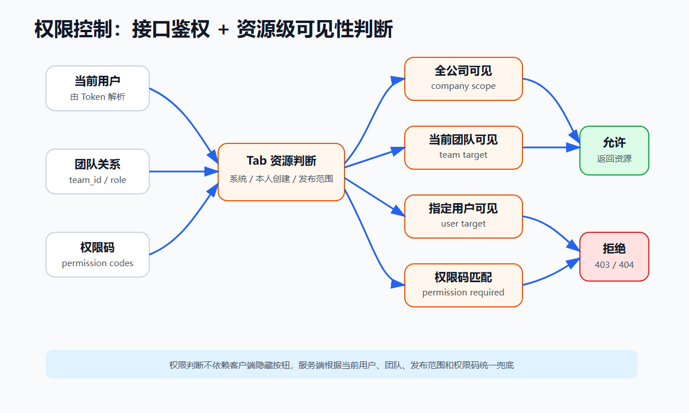
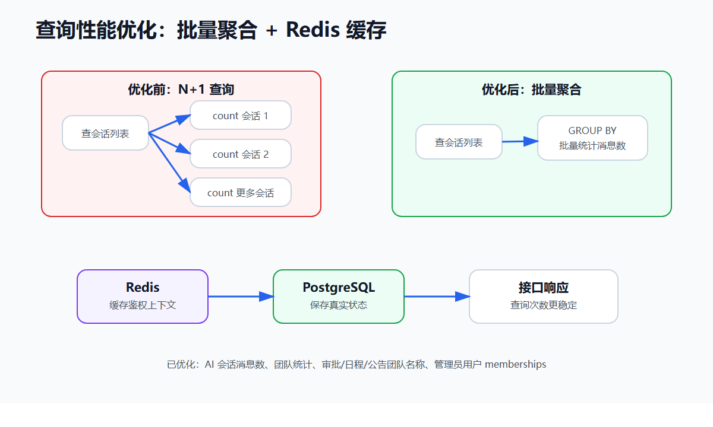
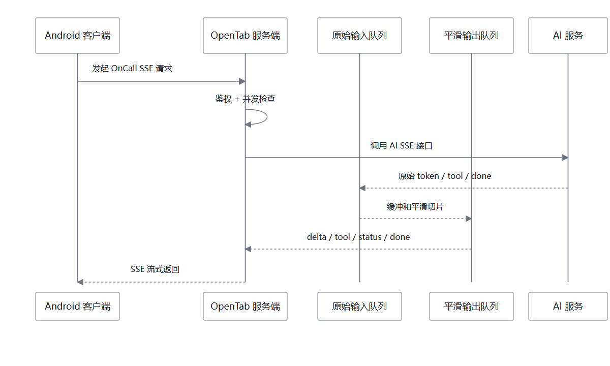

# OpenTab 服务端核心亮点

OpenTab 服务端负责支撑开放式 Tab 容器和 AI OnCall。客户端负责页面展示和交互，服务端负责登录态、权限边界、Tab 下发、业务数据、AI 会话和流式输出稳定性。

技术栈：

- Go + Gin：提供 REST API 和 SSE 流式接口。
- PostgreSQL：保存用户、团队、Tab、审批、日程、公告、AI 会话等数据。
- Redis：缓存高频读取的登录态和用户上下文。
- Repository 模式：支持 Memory 和 PostgreSQL 两种数据实现，便于联调和真实部署切换。

---

## 1. 整体架构



服务端按职责拆成几层：

- `routes`：接口入口，负责读取请求参数、调用 service、返回响应。
- `middleware`：统一处理 Bearer Token、request_id、审计日志。
- `services`：处理主要业务流程，例如登录、Tab 管理、审批、日程、AI 会话。
- `policies`：集中放权限规则，例如能否查看某个 Tab、能否审批某条记录。
- `repositories`：封装数据访问，屏蔽 Memory 和 PostgreSQL 的差异。
- `cache`：封装 Redis 缓存能力。

这种结构让代码修改边界比较清楚。接口变动主要在 routes，业务规则主要在 services，权限判断集中在 policies，数据库查询集中在 repositories。

前期客户端联调时，可以用 Memory 数据快速跑通接口；接入 PostgreSQL 后，客户端调用方式保持一致。这个结构对团队并行开发比较有帮助。

---

## 2. 登录鉴权



登录流程：

1. 客户端提交账号和密码。
2. 服务端校验账号密码。
3. 登录成功后生成随机 token。
4. 服务端把 token 的哈希、用户 ID、过期时间、吊销时间保存到 `auth_sessions`。
5. 客户端后续请求都携带 `Authorization: Bearer <token>`。

后续请求进入服务端后，鉴权中间件会做几件事：

- 检查请求头里有没有 Bearer Token。
- 根据 token 找到对应 session。
- 判断 token 是否过期。
- 判断 token 是否已经 logout 吊销。
- 找到当前用户，并组装成 `CurrentUser` 放入 Gin Context。

`CurrentUser` 里包含：

- `user_id`
- 用户角色
- 当前团队
- 团队身份
- 权限码列表

业务接口不会相信客户端传来的 `userId`。服务端只相信 token 解析出的当前用户。这样可以避免用户通过修改请求参数访问别人的数据。

logout 时，服务端会把当前 session 标记为 revoked。客户端清掉本地 token 后，旧 token 再次请求接口也会被服务端拒绝。

---

## 3. 权限控制



权限控制分成两层。

第一层是接口权限。  
例如访问审批列表时，服务端会先判断用户有没有：

```text
tab.approval.read
```

没有这个权限码，接口直接返回 403。

第二层是资源权限。  
用户有审批查看权限，不代表能看所有审批。服务端还会继续判断这条具体审批是否属于当前用户可见范围。

以 Tab 为例，用户启用一个 Tab 时，服务端会检查：

- 这个 Tab 是否存在。
- 这个 Tab 是否是系统 Tab。
- 这个 Tab 是否由当前用户创建。
- 这个 Tab 是否发布给全公司。
- 这个 Tab 是否发布给当前用户所在团队。
- 这个 Tab 是否指定发布给当前用户。
- 当前用户是否拥有这个 Tab 要求的权限码。

以审批为例，查看或处理审批时，服务端会检查：

- 当前用户是否是申请人。
- 当前用户是否是审批所属团队的主管。
- 当前用户是否是管理员。
- 当前审批状态是否允许继续操作。

以日程为例，服务端会检查：

- 日程是否全公司可见。
- 日程是否属于当前用户所在团队。
- 当前用户是否是创建人或参与人。
- 当前用户是否具备管理权限。

这个设计的意义是：客户端隐藏按钮只能控制界面，服务端权限判断才能真正防止越权。即使有人抓包伪造请求，服务端仍然会根据 token、团队、角色、权限码和资源归属重新判断。

---

## 4. 查询性能优化



服务端里很多接口都是列表查询，例如：

- AI 最近会话列表。
- 团队列表。
- 审批列表。
- 日程列表。
- 公告列表。
- 管理员用户列表。

这类接口容易出现 N+1 查询问题。比如查询 AI 最近会话时，先查出 20 个会话，再对每个会话单独统计消息数量，就会产生很多额外 SQL。

优化后，服务端把这类逻辑改成批量查询和聚合查询：

- AI 最近会话：用 `GROUP BY session_id` 批量统计消息数。
- 团队列表：批量统计成员数和主管数。
- 审批、日程、公告：批量补齐团队名称。
- 管理员用户列表：批量查询用户团队关系。

Redis 也放在这一部分理解更合适。它主要优化的是高频读取路径。

每个受保护接口都会先鉴权，而鉴权需要读取 session、用户、团队关系、权限码。为了减少重复数据库查询，服务端把 token session 和用户上下文缓存到 Redis。

Redis 的定位是缓存，不是主数据库：

- PostgreSQL 保存真实状态。
- Redis 保存短期缓存。
- 权限或团队变更后，服务端主动删除对应用户缓存。
- Redis 不可用时，服务端可以回退到 PostgreSQL。

所以 Redis 的作用是降低高频接口对数据库的重复查询压力，鉴权结果仍然以服务端 session 和 PostgreSQL 数据为准。

---

## 5. AI OnCall 流式输出优化



AI OnCall 的调用链路是：

```text
客户端 -> OpenTab 服务端 -> AI 服务 -> OpenTab 服务端 -> 客户端
```

客户端不直接接触 AI 服务。OpenTab 服务端负责：

- 校验当前用户。
- 创建或读取 AI 会话。
- 保存用户消息。
- 调用 AI 服务的 SSE 接口。
- 解析 AI 返回的流式事件。
- 保存 AI 回复。
- 把结果以 SSE 形式返回给客户端。

为了让流式输出更稳定，服务端做了几类处理：

- 并发限制：控制同时运行的 AI 生成任务数量。
- 同会话任务管理：同一个会话重复生成时，自动取消旧任务。
- 取消生成：客户端取消后，服务端停止继续读取和转发。
- 心跳：长时间没有内容时维持 SSE 连接。
- 双缓冲平滑输出：AI 原始输出先进队列，再按稳定节奏推给客户端。
- 失败降级：AI 服务异常时，返回客户端能识别的错误事件。

双缓冲的核心是把“AI 服务返回内容的节奏”和“客户端展示内容的节奏”分开。AI 可能突然返回一大段，也可能短暂停顿；服务端先接收原始事件，再通过平滑输出队列切片发送，客户端看到的效果会更稳定。

---

## 汇总

服务端的 5 个核心亮点：

1. **整体架构清晰**：分层组织代码，Repository 支持 Memory / PostgreSQL 切换。
2. **登录态可控**：随机 token、session 表、过期校验、logout 吊销。
3. **权限控制到资源**：结合用户、团队、角色、权限码和资源归属判断。
4. **查询性能优化**：批量查询、聚合统计、Redis 缓存高频用户上下文。
5. **AI 流式稳定性**：SSE 转接、并发限制、取消生成、心跳、双缓冲、失败降级。
